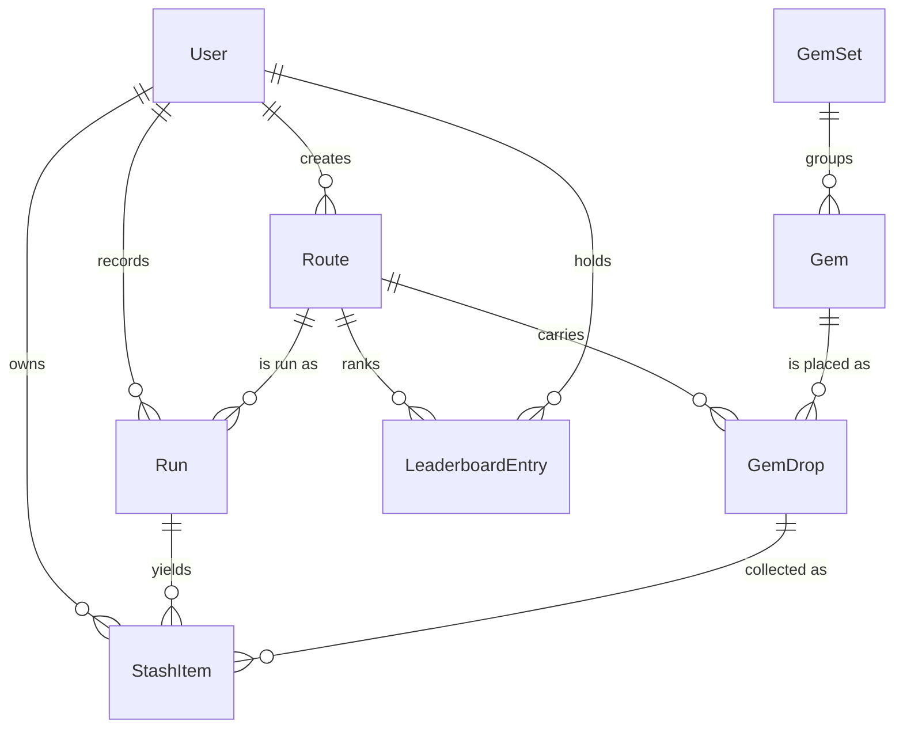

# 05 — Data Model

Canonical (server-side) entities. The backend will be Python (FastAPI assumed) — this doc defines *what* is stored, not how; it exists so the iOS client (doc 07) and API contract (doc 06) are grounded. The final section notes which subset the client mirrors in SwiftData.

## ERD

## Entities

### User
| Field | Type | Notes |
|---|---|---|
| id | uuid | |
| apple_sub | string, unique | Sign in with Apple subject identifier |
| handle | string, unique | Public name; profanity-checked |
| avatar_url | string? | |
| home_geohash | string(5)? | ~5 km cell, **fuzzed by design** — used for Local leaderboard region; never a precise home location |
| xp | int | Denormalized total; source of truth is summed awards |
| level | int | Derived from xp (`100 × level` curve, doc 02) |
| streak_count | int | Consecutive valid-run days |
| streak_shields | int | 0–2 |
| streak_last_date | date | Local-date of last streak-valid run |
| timezone | string | IANA; streak math runs in user-local days |
| created_at | timestamp | |

### Route
| Field | Type | Notes |
|---|---|---|
| id | uuid | |
| creator_id | uuid → User | Null for system-seeded routes |
| name | string(40) | |
| description | string(140)? | |
| polyline | string | Encoded polyline (Google format), the snapped path |
| distance_m | int | Server-recomputed from polyline at publish |
| elevation_gain_m | int | Server-recomputed |
| elevation_profile | ref | Sampled profile for Epic-placement validation + UI strip |
| difficulty | enum | easy / moderate / hard — computed, not creator-set |
| status | enum | draft / published / archived |
| geohash | string(6) | Of route start; geo-query index |
| run_count | int | Denormalized |
| created_at | timestamp | |

### Gem (catalog — a *kind* of gem, not a placement)
| Field | Type | Notes |
|---|---|---|
| id | uuid | |
| name | string | e.g. "Harbor Sapphire" |
| rarity | enum | common / uncommon / rare / epic / legendary |
| set_id | uuid → GemSet | |
| icon_ref | string | Asset key in the client bundle / CDN |
| is_seasonal | bool | Founder set etc. |
| active_from / active_until | timestamp? | Seasonal window |

### GemSet
| Field | Type | Notes |
|---|---|---|
| id | uuid | |
| name / theme | string | |
| badge_ref | string | Badge asset for completion |

### GemDrop (a gem placed at a point on a route)
| Field | Type | Notes |
|---|---|---|
| id | uuid | |
| route_id | uuid → Route | |
| gem_id | uuid → Gem | |
| lat / lng | double | Snapped to polyline |
| position_along_route_m | int | Drives collection ordering + monotonic-progress rule (doc 04) |
| respawn_rule | enum | daily / once_per_user / one_time — derived from rarity (doc 02) but stored explicitly so rules can evolve |
| placed_by | enum | creator / system |
| active | bool | Expired Legendary seeds / removed drops |

### Run
| Field | Type | Notes |
|---|---|---|
| id | uuid | |
| user_id / route_id | uuid | |
| client_idempotency_key | string, unique per user | Offline-sync dedup (docs 04/06) |
| started_at | timestamp | |
| duration_s / distance_m | int | Server-recomputed from track |
| avg_pace_s_per_km | int | Determines run vs walk (doc 02) |
| track_ref | ref | Stored sample array `(t, lat, lng, accuracy, speed)`; object storage, not a table |
| client_flags | string[] | Advisory flags from doc 04 |
| validation_status | enum | pending / valid / flagged / invalid |
| xp_earned | int | Post-validation, multiplier applied |
| created_at | timestamp | |

### StashItem (one collected gem)
| Field | Type | Notes |
|---|---|---|
| id | uuid | |
| user_id / gem_id / gem_drop_id / run_id | uuid | Full provenance (Stash detail sheet, doc 03) |
| collected_at | timestamp | |
| is_first_find | bool | Legendary first-finder variant |

**Respawn rules as uniqueness constraints:**
- `once_per_user`: unique (user_id, gem_drop_id)
- `daily`: unique (user_id, gem_drop_id, local_date(collected_at))
- `one_time`: unique (gem_drop_id) for the first-find variant; standard collections then follow once_per_user until the seed's `active_until`

### LeaderboardEntry (materialized)
| Field | Type | Notes |
|---|---|---|
| route_id / user_id | uuid | Composite key |
| best_time_s | int | Best *valid, run-pace* time |
| best_run_id | uuid | |
| updated_at | timestamp | |

Weekly Local board is computed from validated `xp_earned` grouped by `User.home_geohash` and ISO week — a query/materialized view, not a stored entity.

## Client-side mirror (SwiftData, doc 07)

| Client store | Mirrors | Why |
|---|---|---|
| CachedRoute (+ CachedGemDrop) | Route/GemDrop summaries for the local area | Offline Explore + Route Detail |
| DraftRoute | Unpublished creations | Draw-flow autosave |
| LocalRun | Run + full sample buffer post-completion | Sync queue source; summary re-display |
| StashCache | StashItem + Gem catalog | Offline stash |
| SessionState | User fields (xp, level, streak…) | Optimistic UI, reconciled on sync |

The client never stores other users' data beyond leaderboard DTOs in memory.
