# 16 — Architecture Deep-Dive: How GemRun Is Built, Designed, and Scaled

> The whole system in one illustrated document: what GemRun is, the frameworks it
> stands on and why, how every screen was designed, how the backend creates and
> settles gems, and how the architecture grows to **10,000 simultaneously active
> users**. Diagrams are colored with the app's real "Daybreak Pulse" palette.
> Everything here is verified against the code (docs 01–15 hold the deeper specs;
> §10 lists the places where older docs drifted from the code).

**Contents**
1. [What GemRun is](#1-what-gemrun-is)
2. [Full-system architecture](#2-full-system-architecture)
3. [Frameworks & technology choices](#3-frameworks--technology-choices)
4. [How the app was designed](#4-how-the-app-was-designed) — palette, every screen in color, run pipeline, state model
5. [Backend design](#5-backend-design) — endpoints, data model, gem stocking, settlement, walkability
6. [The wire contract](#6-the-wire-contract)
7. [Anti-cheat & trust model](#7-anti-cheat--trust-model)
8. [Scaling to 10,000 simultaneous users](#8-scaling-to-10000-simultaneous-users)
9. [Testing & CI](#9-testing--ci)
10. [Current status & honest gaps](#10-current-status--honest-gaps)

---

## 1. What GemRun is

GemRun turns any running route into a treasure hunt. The **backend stocks real,
walkable streets with gems** around wherever a runner opens the map; passing
within **100 ft (30.5 m)** with a live GPS track claims a gem — optimistically on
the phone, authoritatively on the server, **first come, first served in one
shared world**. On top: route creation with a gem-placement budget, XP and
levels, daily streaks with shields, leaderboards, and a 26-gem collectible
catalog.

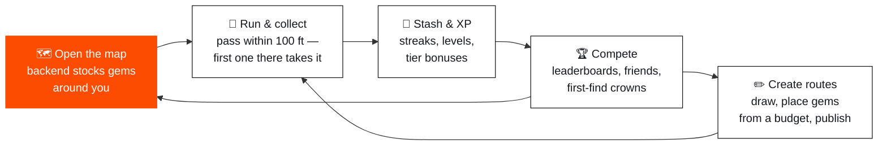

Two products of the same loop:
- **For runners** — there is always something out there to go get: an opened map
  is never empty, and a gem taken by someone else is gone for everyone.
- **For creators** — routes are shareable content: draw a street-snapped path,
  spend a distance-based budget on gem placements, publish, watch the leaderboard.

The two hard problems are named up front in the README and shape the whole
architecture: **GPS spoofing** (client is optimistic, server re-validates every
track) and **placement trust** (no gem may ever sit on a highway or private
land — enforced with OpenStreetMap data at placement time).

---

## 2. Full-system architecture

Two codebases, one wire contract. The iOS app is a thin shell over seven
feature packages and seven core packages; the backend is a single deliberately
boring Django app. They share game rules by **duplication with test parity**,
not by a shared library.

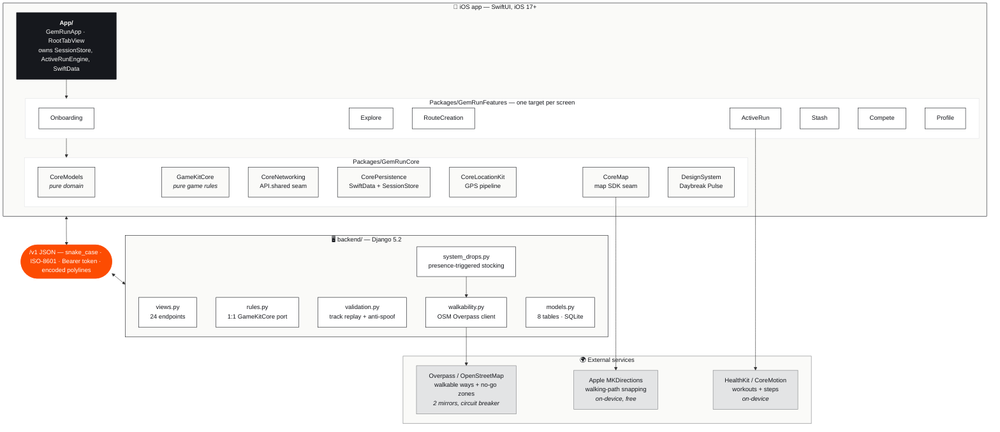

### The three load-bearing seams

The architecture stands on three deliberate seams — each exists so a future
change stays a *contained rewrite* instead of a rearchitecture:

| Seam | Where | What it buys |
|---|---|---|
| **API seam** | `API.shared` in `CoreNetworking/GemRunAPI.swift` — the only object UI code ever talks to | Base URL `nil` → the in-app `MockGemRunAPI` (an actor that *re-implements* the server: idempotency, track replay, respawn dedupe, budgets). Set a URL → the identical calls go over HTTP to Django. Swapping backends is a one-line change; the mock doubles as a living contract test. |
| **Map seam** | `CoreMap` — "nothing outside CoreMap imports a map SDK" | Today: 100 % MapKit (four map views). The planned Mapbox v11 swap (docs/07) means reimplementing only this module — brand styling, gem annotations, chase camera — with zero changes elsewhere. |
| **Rules seam** | `GameKitCore` (Swift) ↔ `backend/api/rules.py` + `validation.py` (Python) | The client enforces every rule offline for instant feedback; the server re-validates everything with the same constants. The **same GPS fixture tracks** run in both test suites, so drift between the twins is caught in CI. Client optimistic, server authoritative. |

---

## 3. Frameworks & technology choices

### 3.1 iOS

| Choice | What & version | Why (as designed, docs/07) |
|---|---|---|
| **SwiftUI** | iOS 17+ baseline, portrait iPhone only | Modern declarative UI; iOS 17 floor unlocks the Observation framework |
| **Observation (`@Observable`)** | MVVM view models + app-level stores | Simpler and faster than `ObservableObject`/Combine — fine-grained invalidation, no `objectWillChange` plumbing. Combine appears nowhere except where an SDK forces it |
| **Swift Concurrency** | async/await, actors, `AsyncStream`; `SWIFT_STRICT_CONCURRENCY: targeted` | The GPS pipeline is an `AsyncStream<TrackSample>`; the mock API is an `actor`; UI stores are `@MainActor` |
| **SwiftData** | `StoredRoute/StoredRun/StoredStashItem/StoredProfile` | Local-first cache with server-authoritative eviction. Complex values (gem drops, elevation profiles) are stored as JSON blobs inside the models — schema churn stays in one place |
| **Local SPM packages** | 2 packages, 14 targets | Dependency rules are *compiler-enforced*: features can't import each other; `CoreModels`/`GameKitCore` are pure (no UI/IO) and unit-testable on any destination |
| **MapKit** | 4 custom map views behind the `CoreMap` seam | Free, native, zero-download today; Mapbox v11 is the planned swap for brand styling (metered MAU pricing is a known trade-off in docs/07–08) |
| **CoreLocation** | `.fitness` activity type, `kCLLocationAccuracyBestForNavigation`, background updates *only during a run* | When-In-Use permission only — never Always. iOS's own location auto-pause is disabled because it never resumes in the background ("the run died in my pocket") |
| **CoreMotion (`CMPedometer`)** | Pedometer-first distance | Once the pedometer reports, GPS deltas stop accumulating distance — GPS jitter otherwise creeps the counter up while standing still |
| **HealthKit** | Write workouts on validated completion; read steps for the run window | Cheap credibility (runs appear in Fitness rings); both directions gated by in-app toggles; invalid or <60 s runs are never saved |
| **CoreHaptics** | Rarity-scaled collection patterns | Common = one thump → legendary = escalating triple burst; `UIImpactFeedbackGenerator` fallback for engineless devices |
| **XcodeGen** | `project.yml` → generated `.xcodeproj` (never committed) | No project-file merge conflicts; CI and `run.sh` regenerate deterministically; build number = git commit count |

### 3.2 Backend

| Choice | What | Why |
|---|---|---|
| **Django 5.2** | One app (`api`), ~3.5 k lines | Batteries (ORM, migrations, management commands, test runner) without ceremony |
| **Plain `JsonResponse` views** | No Django REST Framework | The API surface is 24 handlers with hand-shaped JSON that must byte-match the Swift decoders — a serializer layer would obscure the wire contract the client's regression tests pin |
| **SQLite** | `transaction_mode: "IMMEDIATE"`, 10 s busy timeout | Zero-ops dev database. IMMEDIATE is **load-bearing**: the write lock is taken at transaction *entry*, which is what makes the gem-cap COUNT→INSERT guard race-free. §8 replaces it with Postgres before real load |
| **`urllib` + `certifi`** | Overpass HTTP client | The only third-party runtime deps are Django and certifi — no requests, no Celery, no PostGIS *yet* (each has a planned entrance in the scaling ladder, §8.4) |
| **`ThreadPoolExecutor(2)`** | Background gem stocking inside the web process | Right-sized for a dev server; explicitly a queue-shaped hole where Celery/RQ slots in later (§8.4) |
| **Token auth, hashed at rest** | `Token.key` = SHA-256 digest as primary key; provider IDs stored hashed | Raw secrets never touch disk, from day one — verified by test |

### 3.3 Tooling & delivery

| Tool | Role |
|---|---|
| `run.sh` | One command on a Mac: venv + migrate + seed + **stock gems** + Django (with a TLS preflight probe against Overpass and a full startup report), then XcodeGen → build → Simulator launch. Also `backend` / `app` / `device` (LAN-IP config generation, devicectl install) / `stop` modes |
| `manage.py diagnose` | One-shot health report of the whole gem chain around a coordinate — names the broken link (routes? geometry? Overpass? contract settings?) |
| `manage.py seed / stock_gems / drop_gems` | Street-following demo city · startup stocking pass · global backstop sweep |
| GitHub Actions | 3 jobs on every push: GameKitCore simulator tests (macos-14), full app build with `CODE_SIGNING_ALLOWED=NO` (macos-15), Django tests (ubuntu, Python 3.12) |
| SwiftLint | Configured (`.swiftlint.yml`) — not yet wired into CI |
| `scripts/import-gem-art.sh` | Drops PNGs from `GEMS_REPO/` into the asset catalog at 216 px (one file per gem *material*); runtime falls back to emoji per gem until art lands |

### 3.4 What was deliberately *not* used (yet)

| Not used | Why not (yet) | When it enters |
|---|---|---|
| Django REST Framework | Wire contract is hand-pinned by client regression tests | Probably never — the surface is small |
| Combine | Observation + async/await cover it | Never, by policy |
| PostGIS | Python bbox + planar math is exact enough at dev scale | §8.4 rung 2 |
| Celery / task queue | In-process 2-thread executor suffices for one city | §8.4 rung 2 |
| Mapbox SDK | MapKit free tier while the product finds its shape; seam is ready | Post-MVP (docs/07, docs/10) |
| Remote feature flags / analytics SDKs | A local `FeatureFlags` struct is the MVP answer | Later phases |

---

## 4. How the app was designed

### 4.1 Design language — "Daybreak Pulse"

An Airbnb-style light card UI built from **exactly three colors** (docs/03,
`DesignSystem/Colors.swift`). Opacity steps of a hue count as the same color;
nothing else is allowed on screen.

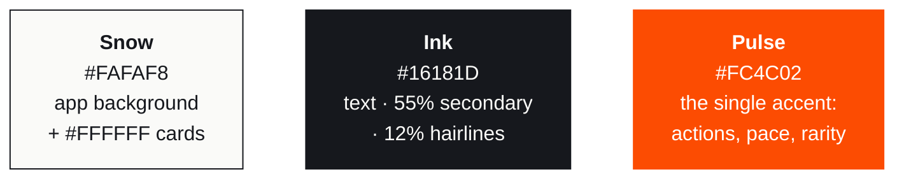

**Rarity is an accent ramp, not new colors** — pulse at rising opacity,
**double-encoded** with a distinct SF Symbol glyph per tier so tiers survive
grayscale and color-blindness (`Colors.swift` rarity ramp + glyphs):

| Layer | Tokens |
|---|---|
| **Type** | SF Pro Rounded at medium weights — `statLarge` / `statMedium` / `heading` scale (`Typography.swift`) |
| **Components** | `.airbnbCard()` (16 pt radius, one diffuse shadow) · `PillButton` · `Chip` · `RarityBadge` / `RarityDots` · `ElevationStrip` sparkline with rarity tick marks · `.pinDrop()` spring entrance (`Components.swift`) |
| **Haptics** | Rarity-scaled CoreHaptics patterns — common: single thump → legendary: escalating triple burst (`Haptics.swift`), played by `HapticPlayer` with an impact-generator fallback |
| **Gem art** | `GemIcon` (CoreMap) prefers a catalog PNG asset per material (`gem.<iconRef>`), falls back to a per-gem emoji; bundle probes are cached per launch |
| **Mood** | Forced light mode (`.preferredColorScheme(.light)`) — Daybreak Pulse is a light system |

### 4.2 Navigation shell

`RootView` gates on onboarding, then shows four tabs. The two immersive flows —
Active Run and Route Creation — are **full-screen covers presented at root**,
triggered through `SessionStore` so any tab can launch them and a run survives
tab switches (`App/Sources/RootTabView.swift`).

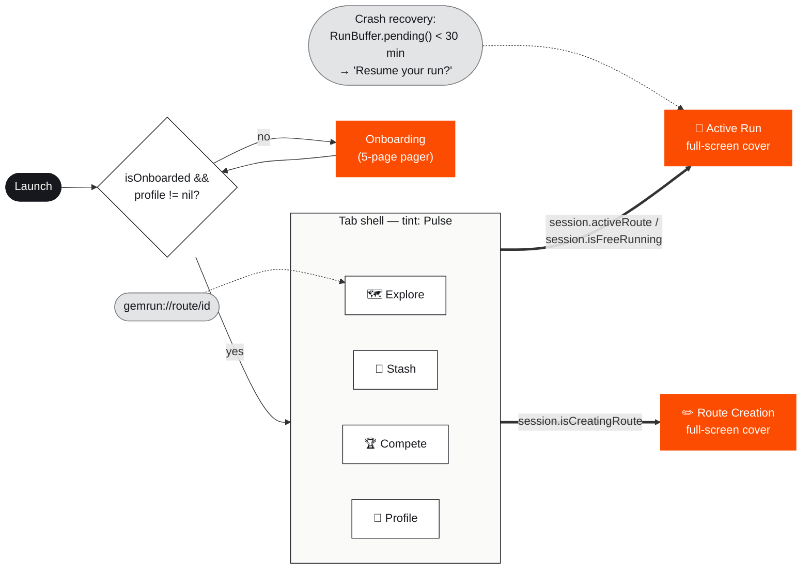

### 4.3 The screens, in color

Each frame below is a wireframe of the real screen in Daybreak Pulse colors
(map areas tinted with the rarity ramp for visibility).

#### Explore — the map home (`FeatureExplore/ExploreRootView.swift`, the largest feature)

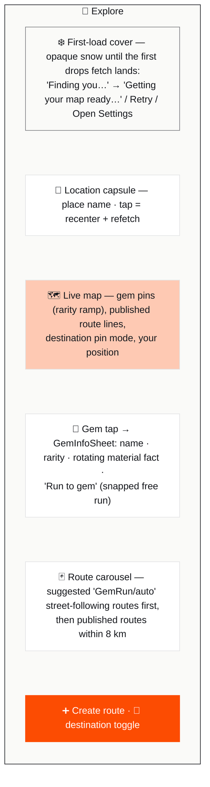

- **Data flow**: on a real GPS fix, `GET /v1/routes` + `GET /v1/drops` fire
  **concurrently** (radius 8 km). Routes upsert into SwiftData with
  backend-authoritative eviction; **drops are never cached** — first-come
  collection makes them change hands too fast. The reveal is a single
  `withAnimation` so pins land in one frame.
- **Refetch discipline** (matters at scale, §8.5): first fix · moved > 1.5 km ·
  app returns to foreground · capsule tap · server said `stocking: true`
  (auto-refetch at ~4 s and ~6 s, **capped at 2**).
- **Suggested routes** (`RouteRecommender`): up to 4 candidates threaded through
  the 1/2/3 nearest gems (+ reversed variants); every leg must snap to Apple
  walking directions or the candidate is dropped — never geometric circles.
  Names draw from a 47-entry pool seeded by (day, ~500 m cell): stable all day,
  fresh tomorrow.
- **Destination mode**: tap a point → snapped path or nothing (a straight line
  is never shown), live "N gems on the way" banner, Start Run synthesizes a
  point-to-point route.

#### Route Detail (`FeatureExplore/RouteDetailView.swift`)

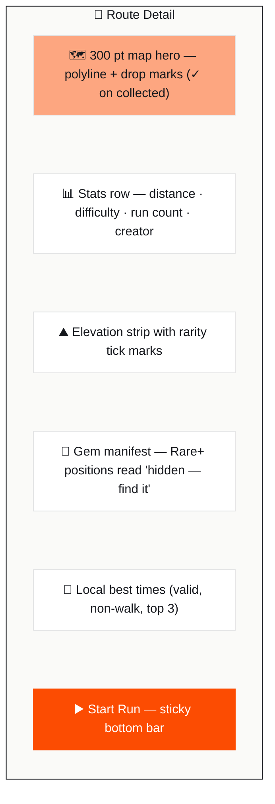

One subtle branch: client-synthesized routes (`creatorHandle == "GemRun/auto"`)
start as **free runs** with drops preloaded — the server never stored them, so a
route-run completion would 404.

#### Route Creation — the 3-step flow (`FeatureRouteCreation/`)

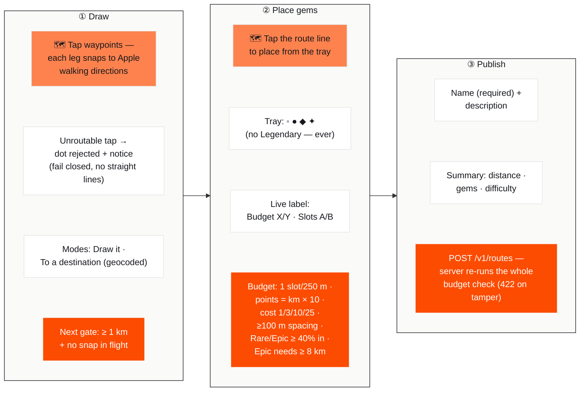

Drawing niceties: a **serial snap worker** resolves legs strictly in order;
"Another path" cycles MKDirections alternates over the same dots; undo is pure
array surgery (no network); a destination plan carries a generation token so a
stale response can never overwrite a newer pin.

#### Active Run (`FeatureActiveRun/ActiveRunView.swift`)

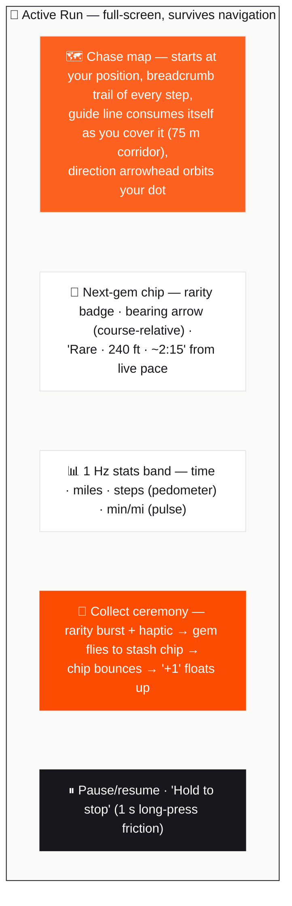

- **Pocket mode**: background location is enabled only for the run's lifetime;
  collections fire local notifications when the app isn't foreground. iOS's own
  location auto-pause is disabled (it never resumes in the background) — the
  app's own auto-pause is speed-based (< 0.5 m/s sustained 10 s).
- **Battery**: adaptive GPS — the distance filter relaxes 5 m → 10 m when the
  next gem is > 500 m away (accuracy is never lowered; that thrashes the
  radio). Battery %/hour is logged against the docs/04 budget (< 8 %/hour).
- **Crash safety**: every sample appends to a JSONL `RunBuffer`; relaunching
  within 30 minutes offers "Resume your run?" and charges the dead-app gap to
  paused time.

#### Run Summary & the shareable card (`RunSummaryView` / `RunCardView` / `ShareCardView`)

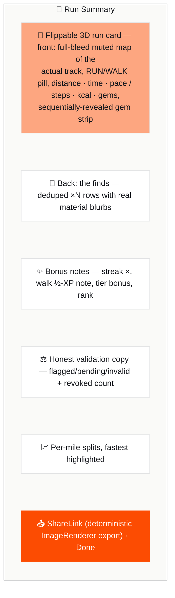

#### Stash · Compete · Profile

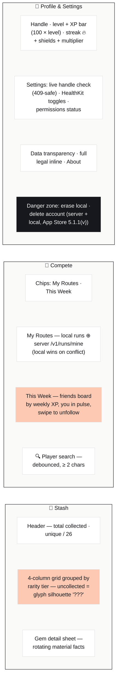

**Onboarding** (`FeatureOnboarding/OnboardingView.swift`) is a 5-page pager:
three value-prop pages → a location-priming page (explains *why* before the
system dialog) → identity: handle + Sign in with Apple + Google (stubbed until
the SDK lands) + "Continue as guest". Under the dev auth flag every path
succeeds and a "Dev mode" note is shown.

### 4.4 The run pipeline, end to end

The heart of the app. `ActiveRunEngine` is owned by the **App**, not a view —
a run survives any navigation or view teardown.

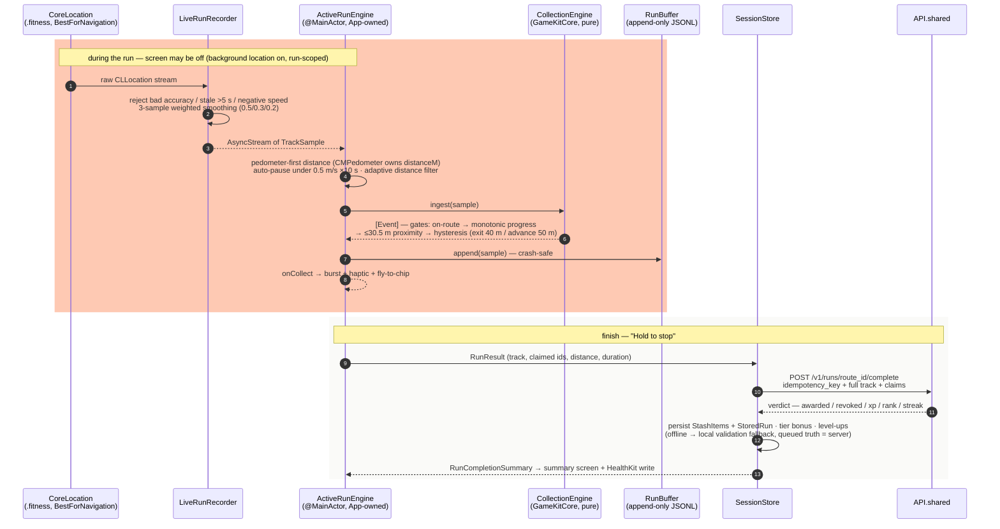

### 4.5 State model & module graph

**`SessionStore`** (`@MainActor @Observable`, `CorePersistence`) is the single
app-wide state owner — auth/profile, onboarding flag, the stash mirror, and the
**cross-feature presentation triggers** (feature packages never import each
other; this is the compiler-enforced rule):

| Trigger | Set by | Presents |
|---|---|---|
| `activeRoute: Route?` | Route Detail "Start Run", destination mode, crash resume | Active Run cover (route mode) |
| `isFreeRunning` + `freeRunDrops/PlannedPath/Name` | Explore "Start Run", "Run to gem", auto-route detail | Active Run cover (free mode) |
| `isCreatingRoute` | Explore ➕ | Route Creation cover |
| `pendingDeepLinkRouteID` | `gemrun://route/{uuid}` | Explore opens the route sheet |

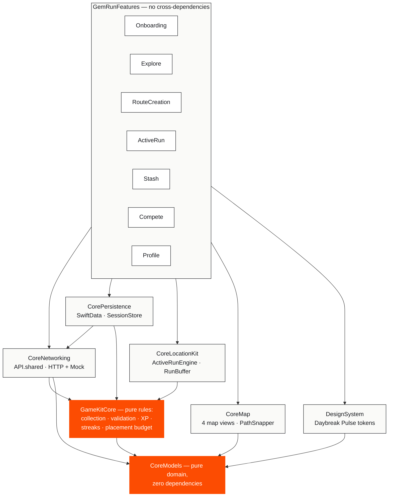

Why the two pulse nodes matter: `CoreModels` and `GameKitCore` have **no
UI or IO imports at all** — they compile anywhere, which is what lets the same
game rules run in unit tests, in the in-app mock server, and (as a Python port)
on the backend.

---

## 5. Backend design

A single Django app (`backend/api/`), deliberately boring: plain function views
returning `JsonResponse`, the ORM on SQLite in dev, and two runtime
dependencies. All the interesting parts are game-domain logic.

| Module | Responsibility |
|---|---|
| `views.py` | All 24 endpoint handlers, auth resolution, JSON shaping, fuzzing |
| `rules.py` | 1:1 port of GameKitCore constants (the Swift file is the reference) |
| `validation.py` | Full-track replay + anti-spoof verdict (port of `RunValidator`/`CollectionEngine`) |
| `system_drops.py` | Presence-triggered gem stocking — the per-mile contract |
| `walkability.py` | Overpass/OSM client: pedestrian network, no-go zones, circuit breaker |
| `geometry.py` | Polyline codec + planar projection (port of `RouteGeometry`) |
| `catalog.py` | The 26-gem catalog with the same fixed UUIDs as the iOS `GemCatalog` |
| `models.py` | 8 tables |
| `management/commands/` | `seed` · `stock_gems` · `drop_gems` · `diagnose` |

### 5.1 Endpoints (all under `/v1/`)

| Area | Endpoint | Notes |
|---|---|---|
| Auth | `POST /auth/{apple\|google}` | Dev flag accepts everything and mints a token; strict mode → 501 until token verification lands. Tokens + provider IDs stored **hashed** |
| Profile | `GET/PATCH/DELETE /users/me` · `GET /handles/check` | PATCH is 409-safe on handle collisions; DELETE is a hard cascade (App Store 5.1.1(v)) |
| Routes | `GET /routes?lat&lng&radius_m` · `POST /routes` · `GET/PATCH/DELETE /routes/{id}` · `GET /routes/{id}/leaderboard` | POST re-runs the full placement budget (422 `placement` on tamper); DELETE soft-archives; Rare+ uncollected drop coords are fuzzed on every read |
| Runs | `POST /runs` · `POST /runs/{route_id}/complete` · `GET /runs/mine` | `start` returns **exact** coords for offline collection; `complete` is the authoritative settlement (§5.4) |
| Stash & boards | `GET /stash` · `GET /leaderboards/local` | Weekly XP board |
| Social | `GET /players?search` · `GET/POST /friends` · `DELETE /friends/{id}` | One-directional follows, idempotent |
| Gems | `GET /gems/catalog` | Static, cacheable — 26 fixed-UUID entries |
| Drops | `GET /drops?lat&lng&radius_m` · `POST /drops` · `POST /drops/collect` | GET **fires the presence trigger** and returns a `stocking` flag; POST gives a stash gem away (legendary refused, walkability-checked); collect is the free-run claim path |

### 5.2 Data model

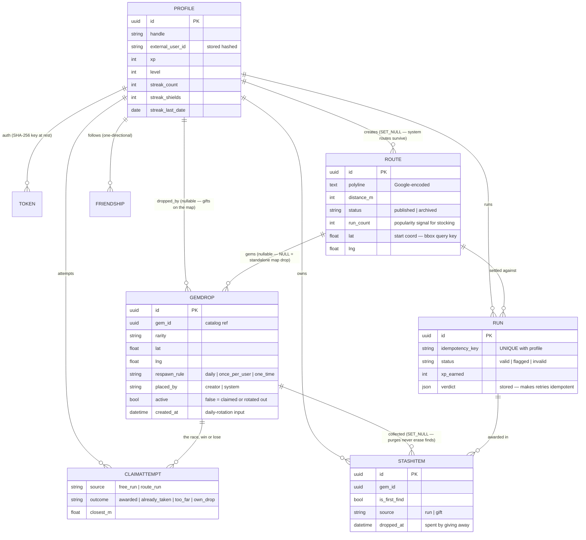

Design notes worth internalizing:
- **The stash IS the economy.** There is no wallet table (removed in migration
  0007). New players get a deterministic welcome gift (3 common / 2 uncommon /
  1 rare); everything else is earned by collecting, and `POST /v1/drops` spends
  an actual stash row (`dropped_at` set — the collection record outlives the
  gift).
- **`ClaimAttempt` records the race; `StashItem` records only the winner.**
  Every claim attempt — winner *and* losers — is logged with outcome and
  closest distance. This is the audit trail for the shared world.
- **Idempotency is a database fact**, not a convention:
  `UniqueConstraint(profile, idempotency_key)` plus the stored verdict JSON
  means a retried completion returns the original verdict byte-for-byte and can
  never double-award.

### 5.3 How gems get created — the stocking pipeline (`system_drops.py`)

Gems are **not** dependent on users placing them. Every map open triggers a
top-up around that exact point — regions nobody visits never spawn gems, and an
opened map is never empty. Full spec: docs/13–14.

```mermaid
flowchart TB
    OPEN(["📱 GET /v1/drops?lat&lng<br/>(every map open)"]):::pulse
    OPEN --> TRY["presence_trigger(lat, lng)<br/><i>wrapped in try/except —<br/>stocking can never break the map read</i>"]:::card
    TRY --> COUNT{"system gems within<br/>'my mile' (1609 m radial)?"}:::card
    COUNT -- "≥ floor (20)" --> DONE(["✅ stocked — others' gems<br/>are your stock too (shared world)"]):::snow
    COUNT -- "< floor" --> MODE{"mile warm or cold?"}:::card
    MODE -- "cold (0 gems)" --> INLINE["run INLINE<br/>budget: 12 s<br/>(the app's loading cover)"]:::ink
    MODE -- "warm" --> ASYNC["queue on 2-worker executor<br/>budget: 60 s · deduped per<br/>~550 m cell → respond<br/>stocking: true (client refetches)"]:::ink
    INLINE --> ROTATE
    ASYNC --> ROTATE
    ROTATE["daily rotation: expire system gems<br/>from before today · trim mile to<br/>hard max (50), newest first"]:::card
    ROTATE --> FETCH["ONE Overpass fetch:<br/>strict pedestrian net + no-go polygons<br/>for the whole mile"]:::card
    FETCH --> T1{"Tier 1 — popular routes<br/>status=published ·<br/>run_count ≥ gate · nearest first"}:::t1
    T1 -- "sample polyline point" --> CHECKS
    T1 -- "none available" --> T2{"Tier 2 — bootstrap:<br/>OSM footway/pedestrian/path ways,<br/>near-weighted sampling"}:::t2
    T2 -- "sample way point" --> CHECKS
    T2 -- "no walkable geometry" --> EMPTY(["⛔ place NOTHING —<br/>'empty beats misplaced'<br/>(no tier 3, no random scatter)"]):::ink
    CHECKS["per-candidate gates:<br/>snap onto pedestrian net ≤ 25 m →<br/>not inside a no-go polygon →<br/>within the mile → ≥ 100 m from<br/>any existing drop"]:::card
    CHECKS --> CREATE["_guarded_create — atomic COUNT→INSERT<br/>(SQLite IMMEDIATE tx): checks BOTH the<br/>requester's mile AND the candidate's own<br/>mile against hard max · rarity roll:<br/>routes 15/45/27/13 · ways 40/30/20/10 ·<br/>Legendary never system-spawns"]:::pulse
    CREATE --> FILL{"reached fill target (35)?"}:::card
    FILL -- no --> T1
    FILL -- yes --> DONE
    classDef card fill:#FFFFFF,stroke:#16181D,color:#16181D
    classDef snow fill:#FAFAF8,stroke:#16181D,color:#16181D
    classDef ink fill:#16181D,stroke:#16181D,color:#FAFAF8
    classDef pulse fill:#FC4C02,stroke:#FC4C02,color:#FFFFFF
    classDef t1 fill:#FC6120,stroke:#16181D,color:#FFFFFF
    classDef t2 fill:#FDA680,stroke:#16181D,color:#16181D
```

**The per-mile contract** (docs/14 §2.1) — every count is radial, and only
`placed_by="system"` gems count (player gifts can neither satisfy the floor nor
consume the cap):

| Constant | Value | Meaning |
|---|---|---|
| `PRESENCE_RADIUS_M` | 1609 m | "my mile" — the unit of every count |
| `PRESENCE_FLOOR` | 20 | below this, a map open triggers restocking |
| `PRESENCE_FILL_TARGET` | 35 | restock stops here |
| `PRESENCE_HARD_MAX` | 50 | never exceeded — re-checked atomically per insert |
| `PLACEMENT_SNAP_MAX_M` | 25 m | max snap distance onto a sidewalk/trail |
| spacing | 100 m | min distance to any existing drop (player drops count here) |

Two properties fall out of this design that matter enormously for scale (§8):
stocking cost is **per unique mile, per day** — not per user — and the whole
pipeline is **idempotent and skippable** (a failed pass just leaves the mile
below floor until the next open).

### 5.4 Run settlement — the authoritative verdict (`views.complete_run`)

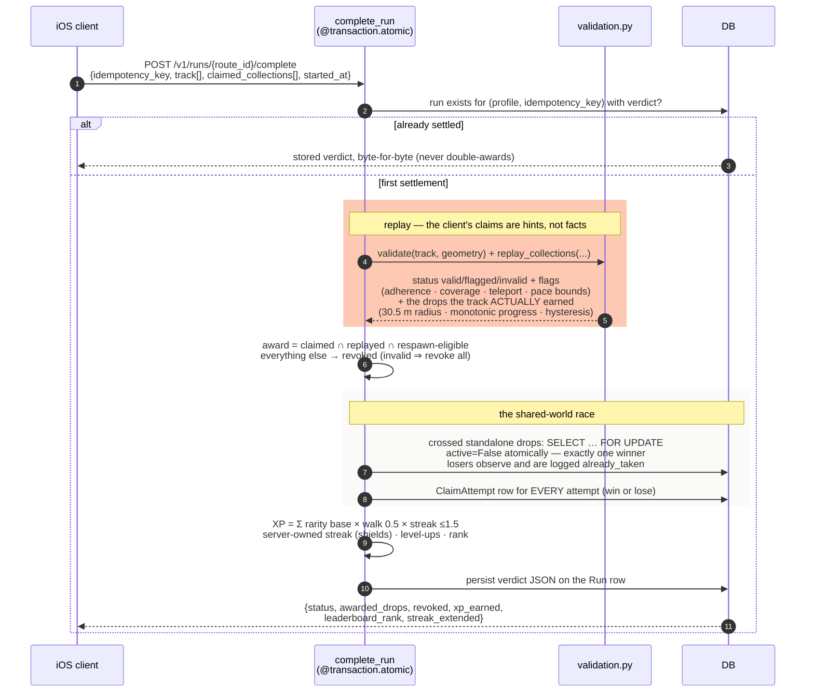

Free runs settle through the lighter `POST /v1/drops/collect`: same row-locked
first-come claim, same audit, but the only proof required is that the track
passed within 30.5 m — with the crucial gate that **GPS samples with accuracy
worse than 50 m are discarded**, so a 200 m-accuracy fix can't prove presence
at anything.

### 5.5 Walkability — the OSM downstream (`walkability.py`)

The "no gems on highways or private land" promise, implemented as one careful
HTTP client:

- **Transport**: Overpass QL POSTed via `urllib` + `certifi` to two mirrors in
  order (overpass-api.de → kumi.systems), purpose-tagged logging on every
  attempt (`point-check (37.77,-122.41) r=25m strict`), exact exception reprs
  on failure.
- **Circuit breaker**: when *every* mirror fails in one call, the circuit opens
  for 120 s and subsequent calls return `None` instantly — Overpass is keyless,
  per-IP throttled, and doomed retries cost ~10 s each.
- **Deadline propagation**: each mirror's timeout is capped to the caller's
  remaining budget; mirrors are skipped entirely under 1 s — an inline stocking
  pass must never outlive the map request it rides in.
- **Three narrowing highway tiers**: seed routes may use residential/track/
  cycleway; *validating* a player gift requires footway/pedestrian/path/steps;
  *placing* system gems excludes even `steps` (building entrances read as
  private).
- **No-go zones**: private/no-access polygons, schools, golf courses, military,
  industrial, railway, aerodromes — ray-cast point-in-polygon with bbox
  prefilters. The private-ness lives on the *enclosing polygon*, not the path,
  so a mapped footpath through a schoolyard is still refused.
- **Failure posture is asymmetric and deliberate**: system placement **fails
  closed** (no geometry → place nothing), player gifts **fail open** (only a
  definite "not walkable" rejects — an outage shouldn't eat a player's gem).

---

## 6. The wire contract

One `/v1` JSON contract (docs/06): snake_case keys, ISO-8601 timestamps without
fractional seconds, `Authorization: Bearer <token>`, Google-encoded polylines.
The Swift decoder config is pinned by wire-format regression tests on both
sides — a `gem_id` → `gemID` acronym mismatch once silently emptied the map,
and the explicit `CodingKeys` blocks that fix it are treated as load-bearing.

**Constants parity** — the rules seam, verified by shared fixture vectors
(`CollectionEngine.swift` ↔ `rules.py`):

| Rule | Value | Swift | Python |
|---|---|---|---|
| Collection radius | **30.5 m (100 ft)** | `collectionRadiusM` | `COLLECTION_RADIUS_M` |
| Hysteresis | exit 40 m / advance 50 m | `hysteresisExitRadiusM/AdvanceM` | `HYSTERESIS_*` |
| On-route | ≤ 40 m cross-track, ≥ 90 % samples | `maxCrossTrackM`, `minOnRouteSampleRatio` | `MAX_CROSS_TRACK_M`, `MIN_ON_ROUTE_SAMPLE_RATIO` |
| Coverage | ≥ 95 % (invalid < 50 %) | `minRouteCoverageRatio` | `MIN_ROUTE_COVERAGE_RATIO` |
| Teleport | > 8 m/s sustained 5 s | `teleport*` | `TELEPORT_*` |
| Pace validity | 150 s/km (vehicle) … 1200 s/km; walk > 600 | pace constants | pace constants |
| GPS proof | accuracy > 50 m can't claim | — (server-side gate) | `MAX_CLAIM_ACCURACY_M` |
| XP | 10/25/75/200/500 · walk ×0.5 · streak ≤1.5 · level = 100×level | `XPRules`, `StreakRules` | `XP_BY_RARITY`, `streak_multiplier` |
| Placement | 1 slot/250 m · points = m÷100 · cost 1/3/10/25 · spacing 100 m · Rare+ ≥ 40 % in · Legendary unplaceable | `PlacementBudget` | `METERS_PER_SLOT` etc. |

**Invariants any new code must respect** (docs/12 §5):
1. **Idempotency** — completion may be retried; downstream effects must dedupe
   on the key or fire only on the verdict-storing pass.
2. **The server verdict is the source of truth** — never propagate client
   claims; they can be (and are) revoked.
3. **Fuzzing is a feature** — Rare+ route-drop coordinates leaving the server
   on any read path are jittered 30–75 m (deterministic per drop) unless the
   viewer already collected it or is starting a run on that route.
4. **Transactions commit before side effects** — settlement runs inside
   `transaction.atomic`; downstream calls happen after commit or get queued.
5. **The dev auth flag will flip** — `ALLOW_ALL_ACCOUNTS` ↔
   `AuthFlags.allowAllAccounts` are temporary twins; new code must not assume
   the permissive posture.

---

## 7. Anti-cheat & trust model

Layered defense; each layer assumes the one before it was beaten:

| Layer | Against | Mechanism |
|---|---|---|
| Client optimism, server authority | tampered clients | The phone celebrates instantly; the server replays the **entire GPS track** and issues the only verdict that persists |
| Pace & physics gates | vehicles, spoofed teleports | < 2:30/km = vehicle (invalid) · > 8 m/s sustained 5 s = teleport flag · > 20:00/km = invalid |
| Route adherence | claim-without-running | ≥ 90 % of samples within 40 m of the line, ≥ 95 % coverage, **monotonic progress** (grazing a switchback collects nothing) |
| GPS accuracy gate | fake low-quality fixes | samples with accuracy > 50 m are discarded before proximity proof |
| Atomic claims | duplicate winners | row-locked `active=False` flip — exactly one winner per gem, ever |
| Idempotent settlement | replay/retry farming | stored verdict returned verbatim for a repeated key |
| Coordinate fuzzing | armchair scraping of rare gems | Rare+ coords jittered ≤ 150 m until *you've* earned them |
| Placement re-validation | budget tampering | publish re-runs every rule server-side → 422 |
| Walkability + no-go zones | gems in unsafe/private places | OSM pedestrian network snap + polygon veto; "empty beats misplaced" |
| **ClaimAttempt audit** | disputes, pattern analysis | every attempt logged — winner and losers, outcome, closest distance |
| App Attest *(planned, docs/10)* | emulated/jailbroken clients | payload field already defined in the contract |

---

## 8. Scaling to 10,000 simultaneous users

This section is the forward-looking design: what actually happens when 10,000
people are **using the app at the same moment**, what breaks first in today's
dev posture, and the migration ladder — building on the ladder the project
already named for itself in docs/15 §11 (per-cell ways cache → Postgres +
PostGIS → self-hosted Overpass).

### 8.1 The load model (honest arithmetic)

Assume 10,000 concurrent users in one metro: **~60 % browsing Explore, ~35 %
mid-run, ~5 % elsewhere** (creation, stash, settings).

| Source of load | Arithmetic | Steady rate |
|---|---|---|
| Map fetches (`GET /routes` + `GET /drops`) | 6,000 browsers × 1 fetch-pair / ~3 min (foreground returns, > 1.5 km moves, recenters) | **~67 req/s** |
| Presence triggers | 1 per drops GET, but ~all short-circuit at the floor check (one indexed COUNT) — real stocking passes happen ~once per mile per day | ~33 cheap COUNTs/s; **stocking work scales with *area*, not users** |
| Run completions | 3,500 runners ÷ ~30 min average run | **~2/s** (each ~1,800 GPS samples ≈ 150–250 KB → ~0.4 MB/s ingress; replay ≈ 10–30 ms CPU each) |
| Free-run collects, stash, boards, social, profile | small payloads | ~15–20 req/s |
| **Total** | | **~120 req/s steady · design for 500–600 req/s peak** (evening rush ×4–5) |

Data volume: at ~50 system gems per stocked mile, a fully-warmed metro of
~2,000–3,000 unique miles holds **~100–150 k active `GemDrop` rows**, plus
`ClaimAttempt` rows growing with every contest. Runs store the verdict, not the
raw track — track payloads are compute, not storage.

The honest headline: **10,000 concurrent is not a big number for this
backend's *shape*** — reads dominate, writes are a few dozen per second, and
the hot paths are already atomic and idempotent. The risk is not throughput
math; it's five specific dev-posture components that were never meant to see
production traffic.

### 8.2 What breaks first, in order

| # | Breaks | Why | Replacement |
|---|---|---|---|
| 1 | `manage.py runserver` | single-process dev server, no TLS, auto-reloader | gunicorn/uvicorn workers behind a load balancer |
| 2 | **SQLite** | `IMMEDIATE` mode serializes **every write in the whole database** behind one lock — correct today, and precisely what melts under 2/s settlements + stocking bursts + claim races; also no concurrent server processes | **Postgres**: MVCC concurrency; `select_for_update` row locks carry over unchanged; the stocking COUNT→INSERT guard swaps the global write lock for a **per-mile advisory lock** (`pg_advisory_xact_lock(cell_key)`) — *more* parallel than today, same contract |
| 3 | In-process `ThreadPoolExecutor(2)` stocking | dies with the web process, multiplies per pod, can't be observed or drained | a real queue (Celery/RQ + Redis). The client-facing contract — respond fast, say `stocking: true`, let the app refetch — **already assumes async** and doesn't change |
| 4 | **Free public Overpass mirrors** | keyless, per-IP throttled; thousands of mile-fetches/day from one egress IP will trip rate limits, and the 120 s circuit breaker then fails whole cities *closed* → empty maps | §8.4 rung 3: import OSM extracts (pedestrian ways + no-go polygons) **into PostGIS** on a weekly refresh — the walkability "downstream call" becomes an indexed local query and the breaker becomes vestigial |
| 5 | Python-side radial filtering + fuzzing per row | bbox prefilter, then per-row planar math in Python over 100 k+ rows | PostGIS `ST_DWithin` on a GiST index (sub-ms), fuzzing already deterministic per drop → cacheable |
| 6 | `ALLOW_ALL_ACCOUNTS` + no rate limits | at 10 k users this is not a game, it's an open write API | flip both auth flags, verify Apple/Google tokens, per-token rate limiting at the edge (docs/10's exit checklist) |

### 8.3 Target architecture at 10 k

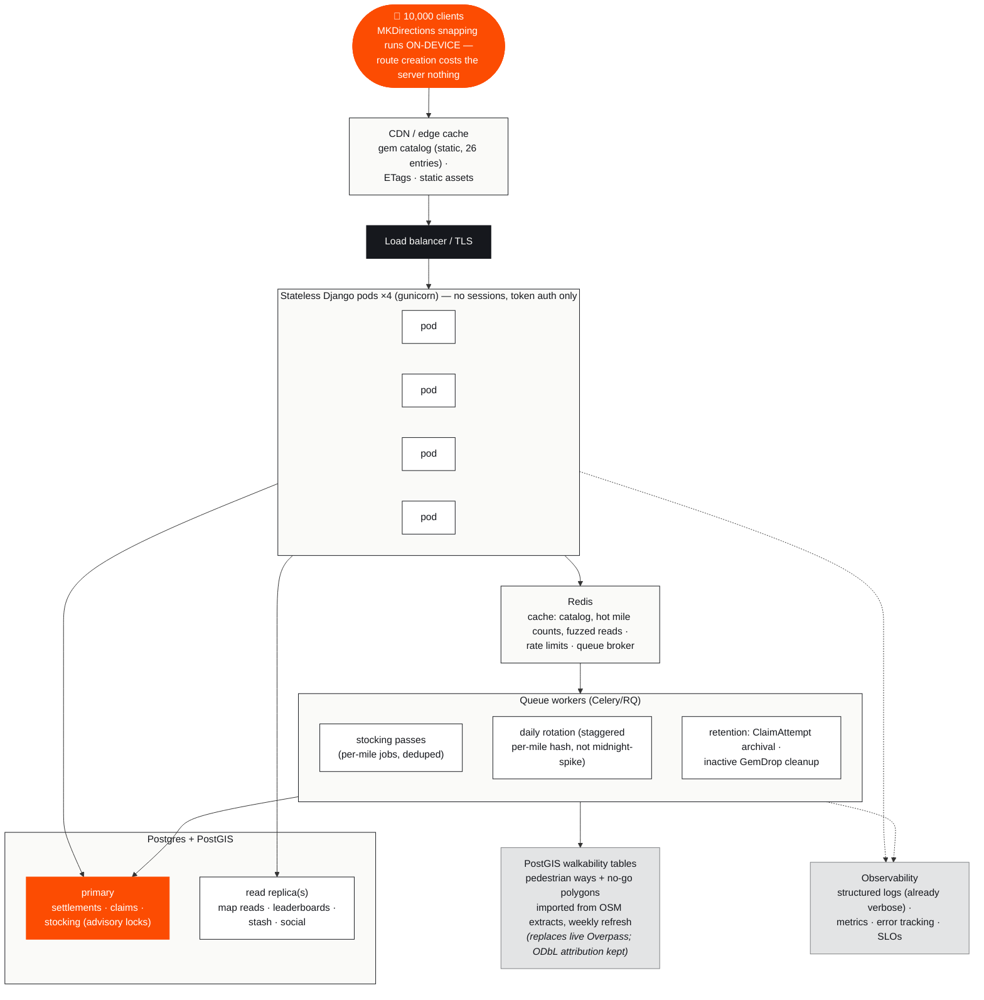

### 8.4 The migration ladder

Each rung is a working system; nothing requires a big-bang rewrite because the
seams (§2) were placed for exactly this.

| Rung | Comfortable up to | What changes | Code or config? |
|---|---|---|---|
| **0 — today** | a dev + friends | SQLite · runserver · in-process stocking · public Overpass · auth flag on | — |
| **1 — first real users** (~500 concurrent) | gunicorn + LB, `DEBUG=False`, secrets, hosts, **Postgres swap**, per-mile advisory lock in `_guarded_create`, flip both auth flags + verify tokens, per-token rate limits | Mostly config; ~2 small code touches (lock helper, auth verify) |
| **2 — one busy city** (~2,000–3,000) | **PostGIS**: geography column + GiST on `GemDrop`/`Route`, `ST_DWithin` replaces bbox+Python · Redis cache (catalog, mile counts) · stocking → **queue workers** (client contract unchanged) · per-cell walkable-ways cache (docs/15's own rung 1) · CDN for catalog | Contained: geo query helpers, executor → task decorator |
| **3 — 10,000+ concurrent** | read replicas + pods ×N · **OSM import into PostGIS** (kill live Overpass; weekly refresh job) · staggered daily rotation · retention jobs · observability + SLOs · App Attest · load tests in CI | Walkability module gets a second, table-backed implementation behind its existing function seams |

### 8.5 What already scales — and must not be "fixed"

The dev-scale code embeds several decisions that are precisely the ones a 10 k
system needs. They should survive every rung untouched:

1. **Stateless requests.** No sessions, no middleware state — a Bearer token
   resolves to a profile per request. Horizontal scaling is adding pods.
2. **Idempotent settlement.** The `(profile, idempotency_key)` constraint +
   stored verdict makes client retries, LB failovers, and at-least-once queues
   all safe. This is the keystone of distributed correctness and it's already
   in the schema.
3. **Per-drop row locks.** Claim contention is per-gem: a race of K runners is
   K−1 brief waits on one row, every loser logged. No global locks anywhere on
   the hot path.
4. **The per-mile contract.** Stocking cost scales with **geography and time**
   (one pass per mile per day), not with user count — 10,000 users in one city
   share the same stocked miles. The mile-cell is also the natural shard key if
   the world ever needs partitioning.
5. **Client-side backpressure.** The `stocking: true` flag with capped
   refetches, the > 1.5 km refetch threshold, drops-never-cached, and the
   first-load gate mean the fleet is polite by construction — no client change
   needed at any rung.
6. **Fail-safe stocking.** The presence trigger is wrapped so stocking can
   never break a map read; a failed pass just retries on a later open.
   "Empty beats misplaced" also means an Overpass/data outage degrades to
   fewer gems, never wrong gems.
7. **Verbose, purpose-tagged logging.** Every Overpass attempt, spawn, HTTP
   call and decode already narrates itself — production observability is
   mostly *shipping* these logs, not writing them.

### 8.6 Hot spots under contention

| Hot spot | Worst case at 10 k | Verdict |
|---|---|---|
| One legendary gem, many runners | K runners cross it in the same minute → K−1 fast row-lock waits, all audited | fine — single-row lock, milliseconds |
| Settlement CPU | 10/s peak × ~20 ms replay | one core; parallel across pods — fine |
| Mile stocking races across pods | two pods below-floor the same mile simultaneously | per-mile advisory lock serializes per mile, parallel across miles |
| Daily rotation at midnight | every mile expires at once → morning stocking stampede | stagger rotation by per-mile hash across the night (worker job, rung 3) |
| Weekly leaderboards | aggregate over a week of runs per request | composite indexes now; Redis sorted sets or materialized views later |
| `ClaimAttempt` growth | every contest, forever | retention job: archive > 90 days (it's an audit log, not gameplay state) |

### 8.7 Capacity summary at 10,000 concurrent

| Resource | Sizing | Headroom logic |
|---|---|---|
| App pods | 4 × 2 vCPU (gunicorn, ~8–16 workers total) | ~600 req/s peak at < 30 % CPU target |
| Postgres | 1 primary (4–8 vCPU) + 1 read replica | writes ~50/s peak; reads offloaded; PostGIS queries indexed |
| Redis | 1 small instance (+ replica) | cache + broker + rate limits |
| Workers | 2 × 1 vCPU | stocking is per-mile-per-day; bursts absorbed by the queue |
| OSM data | one weekly import job, metro extract | replaces every runtime Overpass call |
| Ingress | ~0.5–1 MB/s (tracks dominate) | trivial |

Infra at this scale is a **"few hundred dollars a month" class** system — the
noteworthy cost lines are elsewhere: the planned Mapbox swap is MAU-priced
(docs/07 names this trade-off; MapKit and on-device MKDirections are free), and
Apple Developer + App Store operations. Beyond 10 k concurrent the same shape
keeps working — add pods and replicas, then partition by geo cell if a single
primary's write volume is ever actually reached.

---

## 9. Testing & CI

The strategy is **shared truth, tested twice**:

| Net | What it catches |
|---|---|
| **Shared GPS fixture vectors** — the same straight 1 km route and constant-speed tracks live in `GameKitCoreTests` (Swift) and `api/tests.py` (Python) | drift between the client rules and the server port — the rules seam's insurance |
| **Wire-format regression tests** (both sides) — Django-shaped JSON decoded with the client's exact decoder config; encode direction asserts `gem_id`, never `gemID` | the silent-empty-map class of bug, permanently |
| **Backend suite: 54 tests**, hermetic (Overpass mocked, async stocking off) | settlement + anti-spoof, idempotency, respawn dedupe, streaks, hashing at rest, the per-mile contract (6 tests incl. overlapping miles and radial-vs-bbox), circuit breaker, ClaimAttempt races, fuzzing, a **query-count regression** (route list = flat 4 queries at any page size), management commands, catalog UUID parity with the client |
| **Swift suites** — CalculatorTests, EngineTests, WireFormatTests | placement budget edge cases, streak curve + cap, collection/validation on the fixtures |
| **MockGemRunAPI as a living contract** | the mock re-implements settlement/respawn/budgets with the same engines — the app exercises server semantics with zero backend running |

CI (`.github/workflows/tests.yml`, every push and PR): GameKitCore package
tests on an iPhone 15 simulator (macos-14) · full app build, unsigned
(macos-15, Xcode 16 project format) · Django tests (ubuntu, Python 3.12).

Known gaps (also §10): the Swift monotonic-progress guard lacks a dedicated
test; CoreNetworking/CoreLocationKit/CorePersistence/CoreMap/DesignSystem have
no test targets; SwiftLint is configured but not in CI; the async stocking path
and real Overpass are untested by design.

---

## 10. Current status & honest gaps

**Working end to end today** (live backend by default in Simulator debug
builds): spawn → map → run → collect → settle → audit. All screens in §4 are
implemented, including crash recovery, pocket mode, the share card, tier-grouped
stash, friends boards, and full account deletion.

**Open work** (docs/10 is the tracker):
- **Real auth** — both permissive dev flags must flip together; Django must
  verify Apple `identityToken` / Google `idToken`; Google needs its SDK; Sign
  in with Apple needs a paid developer team.
- **App Attest** — contract field exists; nothing consumes it yet.
- **Production hardening + deploy** — §8 rung 1 is the checklist.
- **Mapbox swap** — the CoreMap seam is ready; token, SDK, four views, Studio style.
- Moderation tools, push notifications, launch-city curated content, the iOS
  offline sync-queue retry loop.

**Where older docs drifted from the code** (verified against source; trust the
code):

| Drift | Reality |
|---|---|
| README/docs/11/docs/12 describe an earn-by-running **wallet** (`/v1/wallet/sync`, km thresholds) | Removed (migration 0007). The **stash is the economy**: welcome gift + collected gems; `POST /v1/drops` spends a stash row |
| docs/15 says map **drop mode** shipped | The validator + sheet exist, but no UI path enables it — currently unreachable |
| docs/07 says maps are **Mapbox v11** | 100 % MapKit today behind the CoreMap seam; Mapbox remains the plan |
| docs/02's set bonus is per **themed set** | Code awards it per **rarity tier** (matches the Stash UI) |
| Test counts (28/32/43 in various docs) | 54 backend test methods |
| docs/15 "27 catalog gems" | 26 entries in both catalogs |
| Minor engine quirks | `elapsed` keeps counting through pauses; auto-resume fires on a single fast sample (no sustain window) and can undo a manual pause |

---

## Appendix — where to go deeper

| Question | Doc |
|---|---|
| Personas, journeys, MVP scope | docs/01 |
| Economy numbers & cold start | docs/02 |
| Screen-by-screen UX spec | docs/03 |
| GPS pipeline & battery budget | docs/04 |
| Entities & relationships | docs/05 |
| Endpoint contract | docs/06 |
| iOS stack decisions | docs/07 |
| Roadmap & risk register | docs/08 |
| Build phases A–F | docs/09 |
| Open work tracker | docs/10 |
| The in-app mock | docs/11 |
| Orientation + every gem-creation path | docs/12 |
| System drops & walkability | docs/13 |
| The stocking pipeline, end to end | docs/14 |
| Completed-features inventory | docs/15 |

