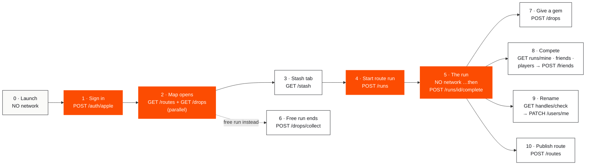
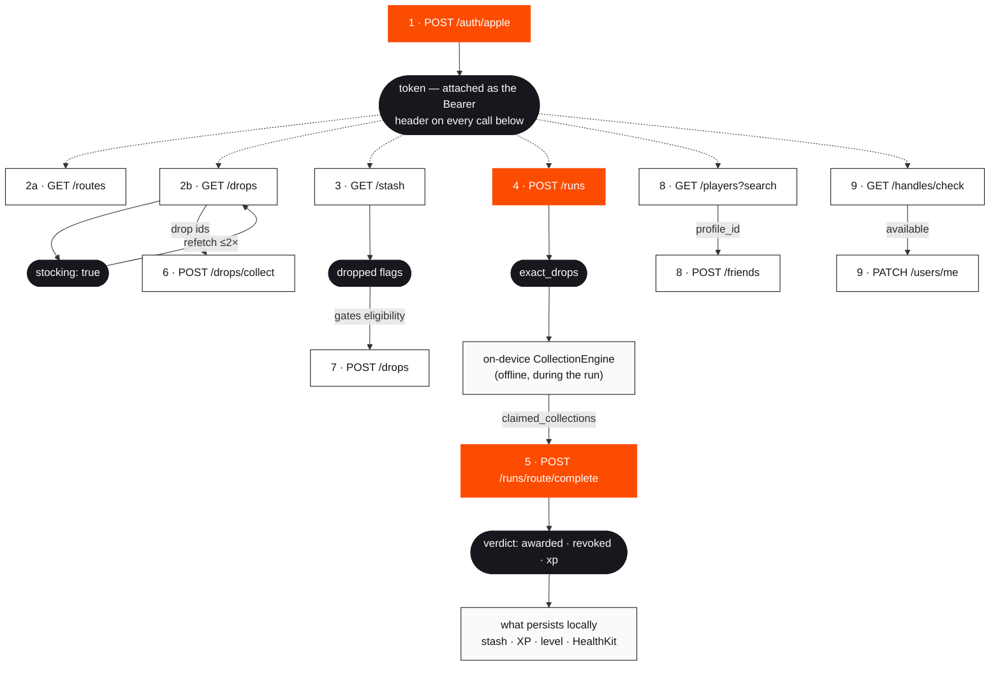

# 17 — The Wire Trace: Every Request & Response, From App Launch Onward

> One user's day with GemRun, told as network traffic. Every API call in the
> order it actually fires, with the **full request and response payloads**,
> **when** each one happens, and — after every response — **which later call
> uses it**. Payloads verified against the client
> (`Packages/GemRunCore/Sources/CoreNetworking/APIClient.swift`) and the server
> (`backend/api/views.py`). The endpoint *contract* lives in docs/06; the
> architecture around it in docs/16. This doc is the traffic itself.

**How to read this:** each numbered **Moment** is a real event in the app
(a tap, a GPS fix, a finished run). For each moment you get:

- **WHEN** — the exact trigger
- **REQUEST** — what leaves the phone
- **RESPONSE** — what comes back
- **➜ FEEDS** — the later call (or decision) that uses this response

---

## The whole day at a glance



Orange = the moments that define the game (identity, the stocked map, the
exact-coordinates handoff, the authoritative settlement). White = everything
else, callable in any order once signed in.

---

## Global mechanics (apply to every call below)

| Mechanic | Detail |
|---|---|
| **Base URL** | Resolved once at launch: `GEMRUN_API_URL` env → `GemRunAPIBaseURL` Info.plist → simulator-debug default `http://127.0.0.1:8000` → `nil` = in-app mock (`GemRunAPI.swift`) |
| **Auth header** | `Authorization: Bearer <token>` — the token from Moment 1, attached to every later request. Server stores only its SHA-256 digest |
| **Encoding** | snake_case keys both directions, ISO-8601 timestamps without fractional seconds (`2026-07-30T15:00:04Z`), UUIDs as lowercase strings, routes as Google-encoded polylines |
| **Errors** | Always `application/problem+json`: `{"title": "...", "detail": null, "code": "handle_taken"}` — the client switches UI on `code` |
| **Timeouts** | 15 s per request / 30 s per resource (deliberately not URLSession's 60 s default — the server bounds its own slow path, so anything slower is a dead network) |
| **Logging** | Every call prints one line: `[API] GET /v1/drops → OK (4812 bytes)` or the full decode error — the regression scar of a decode mismatch that once silently emptied the map |
| **Retries** | Safe by design where it matters: run completion is idempotent (Moment 5), drop claims are first-come-atomic (Moments 5–6) |

---

## Moment 0 — App launch: **zero network**

**WHEN:** the app process starts.

Nothing is sent. `SessionStore.attach()` reads the local SwiftData profile and
the `isOnboarded` flag from UserDefaults; `API.shared` is lazy and hasn't even
opened a connection. The first packet leaves the phone at **sign-in** (fresh
install) or at the **first map open** (returning user).

> ➜ **FEEDS:** nothing — that's the point. Launch is instant and offline-safe.

---

## Moment 1 — Sign in (Onboarding, last page)

**WHEN:** the user taps *Sign in with Apple* / *Continue as guest* on the
final onboarding page.

**REQUEST**

```http
POST /v1/auth/apple
Content-Type: application/json
```
```jsonc
{ "handle": "ali" }
```

**RESPONSE — 200**

```jsonc
{
  "token": "9f3c1a7e4b2d8c6a0e5f19d47b3a82c1e6d0f4a89b7c2e5d13f6a8b90c4e7d21",
  "profile": {
    "id": "b7e2c9d4-1f3a-4e8b-9c56-2d7a8f0e4b13",
    "handle": "ali",
    "avatar_url": null,
    "xp": 0,
    "level": 1,
    "streak_count": 0,
    "streak_shields": 0
  }
}
```

Server-side, this call also does something invisible: for a **new** profile it
creates the welcome gift — 3 common, 2 uncommon, 1 rare stash rows. The client
doesn't see them here; it *discovers* them in Moment 3.

> ➜ **FEEDS:**
> - `token` → the `Authorization: Bearer` header on **every request for the
>   rest of this document**. The single most important handoff in the app.
> - `profile` → the local `StoredProfile` (handle, level, streak shown in
>   Profile tab without another call).

**Error variant** — with the dev flag off and verification not yet built:

```http
501 { "title": "Identity token verification not yet enabled", "code": "auth_strict_mode" }
```

**Dev-posture honesty:** today the client sends *only* `handle` — no
`external_user_id`, no Apple identity token (that's the docs/10 auth work), so
the server mints a fresh profile per sign-in. And the token lives in a client
variable, **not the Keychain yet** ("Phase F polish") — after a relaunch,
requests go out with no Bearer header and the dev server falls back to the
shared `dev-fallback` guest profile.

---

## Moment 2 — Explore opens: the two map reads (deliberately parallel)

**WHEN:** the Explore tab has a **real GPS fix** (that gate is a device event,
not an API response — no fix, no fetch, the snow cover stays up). Then both
calls fire **concurrently**; neither waits for the other. They fire again on:
moving > 1.5 km, returning from background, tapping the location capsule, or a
`stocking: true` response (see below).

**REQUEST (a) — routes**

```http
GET /v1/routes?lat=37.7749&lng=-122.4194&radius_m=8000
Authorization: Bearer 9f3c1a7e…
```

**RESPONSE — 200**

```jsonc
{
  "routes": [
    {
      "id": "c41d7a2e-9b05-4f38-8e61-3a7d2c9f0b54",
      "name": "Marina Loop",
      "description": null,
      "polyline": "a~l~Fjk~uOwHJy@P…",          // Google-encoded, decodes to the draw line
      "distance_m": 5200,
      "elevation_gain_m": 40,
      "difficulty": "moderate",                  // server-computed from distance
      "status": "published",
      "creator_handle": "maya",
      "run_count": 12,
      "elevation_profile": [3, 5, 9, 14, 11],
      "gem_drops": [
        {
          "id": "d9a04c7b-2e81-4b63-a05f-7c3e9d1f2a86",
          "gem_id": "00000000-0000-0000-0000-0000000000a1",
          "rarity": "common",
          "lat": 37.7761, "lng": -122.4188,      // commons are always exact
          "position_along_route_m": 400,
          "respawn_rule": "daily",
          "placed_by": "creator",
          "fuzz_radius_m": null
        },
        {
          "id": "e772b8f0-5c94-4a17-b3d8-0f6a2e4c9b51",
          "gem_id": "00000000-0000-0000-0000-0000000000b4",
          "rarity": "rare",
          "lat": 37.77918, "lng": -122.41601,    // ← JITTERED 30–75 m — not the real spot
          "position_along_route_m": 3900,
          "respawn_rule": "once_per_user",
          "placed_by": "creator",
          "fuzz_radius_m": 150                   // ← "it's somewhere in this circle"
        }
      ]
    }
    // … every published route whose start is inside the box
  ]
}
```

**REQUEST (b) — drops.** Note: this GET is also **the trigger that makes the
server stock the area** (docs/14) — the query's own coordinates are the
capture point.

```http
GET /v1/drops?lat=37.7749&lng=-122.4194&radius_m=8000
Authorization: Bearer 9f3c1a7e…
```

**RESPONSE — 200**

```jsonc
{
  "drops": [
    {
      "id": "f1b3d6a8-4e07-49c2-8b5d-1a9f3c7e0d24",
      "gem_id": "00000000-0000-0000-0000-0000000000a7",
      "rarity": "uncommon",
      "lat": 37.7731, "lng": -122.4210,          // standalone drops are always exact
      "position_along_route_m": 0,
      "respawn_rule": "daily",
      "placed_by": "system",                     // stocked by the presence pipeline
      "fuzz_radius_m": null
    }
    // … up to 200, newest first
  ],
  "stocking": true    // ← a background restock is running for this area RIGHT NOW
}
```

> ➜ **FEEDS:**
> - `stocking: true` → the client schedules **this same GET again** at ~4 s
>   and ~6 s (hard-capped at 2 retries) — a response field literally
>   scheduling the next request.
> - `drops[].id` → held in memory only (drops are *never* cached — they change
>   hands too fast) → they become the `claimed` array in **Moment 6**'s
>   collect call, and the preloaded targets of any free run.
> - `routes[]` → upserted into SwiftData; any cached route **absent** from
>   this response is deleted (the server is authoritative).
> - The rare drop's fuzzed coordinates → shown on the map as a "somewhere
>   here" hint, but **never used for collection** — the real ones arrive in
>   Moment 4.
> - Both responses landing → the first-load snow cover dissolves (pins and
>   reveal happen in a single animation frame).

---

## Moment 3 — Stash tab

**WHEN:** first visit to the Stash tab, every pull-to-refresh, and after every
settled run.

**REQUEST**

```http
GET /v1/stash
Authorization: Bearer 9f3c1a7e…
```

**RESPONSE — 200**

```jsonc
{
  "items": [
    {
      "id": "a2c47e91-6b38-4d05-9f2a-8c1e5d7b3f60",
      "gem_id": "00000000-0000-0000-0000-0000000000a1",
      "gem_drop_id": "00000000-0000-0000-0000-000000000000",  // zero-UUID = welcome gift (no drop)
      "run_id": "00000000-0000-0000-0000-000000000000",       // zero-UUID = no run
      "collected_at": "2026-07-30T14:02:11Z",
      "is_first_find": false,
      "source": "gift",                                        // "gift" | "run"
      "dropped": false                                         // true once given away (Moment 7)
    }
    // … newest first
  ]
}
```

> ➜ **FEEDS:**
> - Items merge into SwiftData (matched by `id` *or* `gem_drop_id`; the
>   zero-UUID sentinel means "no drop behind this").
> - `dropped` → **gates Moment 7**: a gem with `dropped: true` is never
>   offered in the give-away sheet again, so a spent copy can't be re-spent.
> - `gem_id` → resolved against the **built-in** 26-gem catalog (same fixed
>   UUIDs as the server) — this is why no catalog call appears in this trace.

---

## Moment 4 — Start a route run

**WHEN:** the user taps **Start Run** on a route detail sheet. (Client-side,
the drop list is first filtered to what's still collectable *today* for this
user — dailies already collected today and Rare+ already owned are stripped so
the run never celebrates something the server would revoke.)

**REQUEST**

```http
POST /v1/runs
Authorization: Bearer 9f3c1a7e…
```
```jsonc
{ "route_id": "c41d7a2e-9b05-4f38-8e61-3a7d2c9f0b54" }
```

**RESPONSE — 200**

```jsonc
{
  "run_id": "77aa19e3-8c40-4b7f-a6d2-5e9b0c3f8d17",
  "exact_drops": [
    {
      "id": "e772b8f0-5c94-4a17-b3d8-0f6a2e4c9b51",   // same rare drop as Moment 2…
      "gem_id": "00000000-0000-0000-0000-0000000000b4",
      "rarity": "rare",
      "lat": 37.77890, "lng": -122.41645,             // ← …but now the REAL coordinates
      "position_along_route_m": 3900,
      "respawn_rule": "once_per_user",
      "placed_by": "creator",
      "fuzz_radius_m": null                            // unfuzzed — you've earned the hunt
    }
    // … every active drop on this route, exact
  ]
}
```

> ➜ **FEEDS — the most important handoff in the game:**
> - `exact_drops` → loaded into `ActiveRunEngine` / `CollectionEngine`.
>   Collection during the run is detected against **these** coordinates,
>   entirely on-device, **fully offline** — airplane mode mid-run still
>   collects. The fuzzed Moment-2 coordinates are never used for detection.
> - The drop `id`s the engine actually detects → become
>   `claimed_collections` in **Moment 5**'s request.
> - Honest note: `run_id` is currently informational — Moment 5 is addressed
>   by *route* id, and the idempotency key is client-generated.

---

## Moment 5 — The run itself (**zero network**) … then the settlement

**WHEN (during):** the entire run — GPS pipeline, collection detection,
ceremony, pause/resume, crash-safe buffer — makes **no API calls**. Everything
needed was front-loaded in Moment 4.

**WHEN (finish):** the user holds **Hold to stop** for 1 second.

**REQUEST** — note the path uses the **route** id:

```http
POST /v1/runs/c41d7a2e-9b05-4f38-8e61-3a7d2c9f0b54/complete
Authorization: Bearer 9f3c1a7e…
```
```jsonc
{
  "idempotency_key": "3f6e8a1c-7d29-4b50-9e83-b4f0a6c2d715",  // client-generated UUID
  "started_at": "2026-07-30T15:00:04Z",
  "ended_at":   "2026-07-30T15:31:40Z",
  "track": [
    { "t": 0.0, "lat": 37.77490, "lng": -122.41940,
      "horizontal_accuracy": 5.0, "speed": 2.9 },
    { "t": 1.0, "lat": 37.77493, "lng": -122.41941,
      "horizontal_accuracy": 4.8, "speed": 3.0 }
    // … ~1,800 samples at 1/s for a 30-min run — the payload is ~150–250 KB.
    // "t" is seconds since start; duration/pace are recomputed from this,
    // not trusted from the client.
  ],
  "claimed_collections": [
    "d9a04c7b-2e81-4b63-a05f-7c3e9d1f2a86",   // ← the ids Moment 4's engine detected
    "e772b8f0-5c94-4a17-b3d8-0f6a2e4c9b51"
  ],
  "client_flags": [],
  "client_streak_days": 3     // mock-era field — the real server owns streaks itself
}
```

The server treats `claimed_collections` as **hints, not facts**: it replays the
whole track through the same geometry/validation rules the phone used
(30.5 m radius, monotonic route progress, hysteresis, pace and teleport gates)
and awards only what the replay supports.

**RESPONSE — 200, the authoritative verdict**

```jsonc
{
  "status": "valid",                    // "valid" | "flagged" | "invalid"
  "awarded_drops": [
    { "id": "d9a04c7b-…", "gem_id": "…00a1", "rarity": "common",
      "lat": 37.7761, "lng": -122.4188, "position_along_route_m": 400,
      "respawn_rule": "daily", "placed_by": "creator", "fuzz_radius_m": null },
    { "id": "e772b8f0-…", "gem_id": "…00b4", "rarity": "rare",
      "lat": 37.77890, "lng": -122.41645, "position_along_route_m": 3900,
      "respawn_rule": "once_per_user", "placed_by": "creator", "fuzz_radius_m": null }
    // may ALSO include standalone map drops your track happened to cross —
    // claimed first-come-first-served inside the same transaction
  ],
  "revoked": [],                        // claims the replay did NOT support
  "xp_earned": 94,                      // rarity XP × walk ×0.5? × streak ≤1.5 — server math
  "leaderboard_rank": 3,                // only for valid, non-walk runs
  "streak_extended": true               // server-owned streak decision
}
```

> ➜ **FEEDS — the only thing that persists:**
> - `awarded_drops` → the stash rows and summary-card gems. What the phone
>   celebrated mid-run does **not** count; this list does.
> - `revoked` → quietly dropped, with honest copy on the summary screen.
> - `xp_earned` + rank → profile XP/level-ups and the summary card.
> - `status` → gates the HealthKit workout write (never written for
>   `invalid`).
> - **Offline?** The client falls back to local validation so the summary
>   still appears — but the server never learns about the run (the retry
>   queue is an open docs/10 item).
> - **Retried?** Same `idempotency_key` → the server returns **this exact
>   JSON** from storage, byte-for-byte. Nothing double-awards, ever.

---

## Moment 6 — Free run ends (map run / "Run to gem")

**WHEN:** a free run (no route) finishes. There was no start call — the
targets came from **Moment 2's** drops response, held in memory.

**REQUEST**

```http
POST /v1/drops/collect
Authorization: Bearer 9f3c1a7e…
```
```jsonc
{
  "claimed": ["f1b3d6a8-4e07-49c2-8b5d-1a9f3c7e0d24"],   // ← ids from GET /v1/drops
  "track": [
    { "t": 0.0, "lat": 37.77310, "lng": -122.42100,
      "horizontal_accuracy": 6.1, "speed": 2.4 }
    // … full track, same shape as Moment 5
  ]
}
```

**RESPONSE — 200**

```jsonc
{
  "awarded_drops": [
    { "id": "f1b3d6a8-…", "gem_id": "…00a7", "rarity": "uncommon",
      "lat": 37.7731, "lng": -122.4210, "position_along_route_m": 0,
      "respawn_rule": "daily", "placed_by": "system", "fuzz_radius_m": null }
  ],
  "xp_earned": 25
}
```

Server rules per claimed id, in order: your own drop → refused · track never
came within 30.5 m (samples with accuracy worse than 50 m are ignored — bad
GPS can't prove presence) → refused · already taken (row-locked; exactly one
winner per gem, ever) → refused. **Every attempt is logged** to the
`ClaimAttempt` audit table, winners and losers alike.

> ➜ **FEEDS:** `awarded_drops`/`xp_earned` → local stash + profile, same as
> Moment 5. An id that came back in *neither* list simply lost the race.

---

## Moment 7 — Give a gem away on the map

**WHEN:** the user picks a gem in the drop sheet and confirms a spot.
Eligibility was decided by **Moment 3's** `dropped` flags.

**REQUEST**

```http
POST /v1/drops
Authorization: Bearer 9f3c1a7e…
```
```jsonc
{
  "gem_id": "00000000-0000-0000-0000-0000000000a7",
  "lat": 37.7752,
  "lng": -122.4181
}
```

**RESPONSE — 200** (a brand-new drop, live for everyone else immediately)

```jsonc
{
  "id": "9c1e4b70-3a86-4d29-b5f1-8e0d7a2c6f43",
  "gem_id": "00000000-0000-0000-0000-0000000000a7",
  "rarity": "uncommon",
  "lat": 37.7752, "lng": -122.4181,
  "position_along_route_m": 0,
  "respawn_rule": "one_time",           // first finder takes it, forever
  "placed_by": "creator",
  "fuzz_radius_m": null
}
```

**Error variants:** `422 not_walkable` (no real sidewalk/trail near the spot —
only a *definite* "no" from OpenStreetMap rejects; an outage lets it through) ·
`422 not_in_stash` · `422 "Legendary gems cannot be dropped"`.

> ➜ **FEEDS:** the pin goes straight onto the map from this response; the
> spent stash row comes back with `dropped: true` on the next Moment 3 —
> closing the loop that gates this very call.

---

## Moment 8 — Compete tab

**WHEN:** opening the tab fires two **independent, parallel** reads:

```http
GET /v1/runs/mine          → { "runs": [ { "id": "…", "route_id": "…", "route_name": "Marina Loop",
                                           "started_at": "2026-07-30T15:00:04Z", "duration_s": 1896,
                                           "distance_m": 5210, "pace_s_per_km": 364, "is_walk": false,
                                           "status": "valid", "xp_earned": 94 } ] }   // last 50

GET /v1/friends            → { "friends": [ { "id": "b7e2…", "handle": "ali", "level": 2, "is_me": true,
                                              "weekly_xp": 119, "weekly_distance_m": 8340,
                                              "weekly_runs": 2 } ] }   // ranked by weekly XP, me included
```

**Adding a friend is a real response → request → response chain:**

```http
GET /v1/players?search=ma
→ { "players": [ { "id": "b0d2f8c1-…", "handle": "maya", "level": 7 } ] }   // ≥2 chars, cap 20, never me

POST /v1/friends
{ "profile_id": "b0d2f8c1-…" }        // ← the id came from the search response
→ { "friends": [ …the full refreshed board, me + maya, re-ranked… ] }
```

> ➜ **FEEDS:** the add-friend **response is the new board** — the UI renders
> it directly, no follow-up GET needed. Unfollow is
> `DELETE /v1/friends/{id}` → `{}` (removes only *your* follow row).

---

## Moment 9 — Renaming yourself (Settings)

**WHEN:** every keystroke in the username field (debounced ~300 ms) fires the
check; **Save** fires the PATCH.

```http
GET /v1/handles/check?handle=ali_runs
→ { "available": true }               // under 3 chars → always false; your own handle → true
```
```http
PATCH /v1/users/me
{ "handle": "ali_runs" }
→ 200 { "id": "b7e2…", "handle": "ali_runs", "avatar_url": null,
        "xp": 119, "level": 2, "streak_count": 4, "streak_shields": 0 }
```

**The race, handled:** someone can take the name between check and save —

```http
→ 409 { "title": "That username is taken", "detail": null, "code": "handle_taken" }
```

> ➜ **FEEDS:** `available` → enables/disables the Save button (a response
> gating a request); the 409 `code` → inline "just got taken" UI. Also here:
> `DELETE /v1/users/me` → `{}` — full account deletion (server cascade, then
> local erase, then sign-out).

---

## Moment 10 — Publishing a created route

**WHEN:** the **Publish** button at the end of the 3-step creation flow.

**REQUEST** — the client's full route object; note the gems ride inside it:

```jsonc
// POST /v1/routes
{
  "id": "5e8d2c40-91b7-4f6a-8d35-c0a4e7f21b98",       // client-proposed; server honors it
  "name": "Sunset Sprint",
  "description": "Flat and fast along the water",
  "polyline": "}_p~F`aquO}CoAeB_A…",
  "distance_m": 3120,                                   // server RECOMPUTES from the polyline
  "elevation_gain_m": 12,
  "elevation_profile": [2, 3, 3, 5],
  "difficulty": "easy",                                 // server recomputes this too
  "status": "published",
  "creator_handle": null,
  "run_count": 0,
  "gem_drops": [
    { "id": "1a2b3c4d-…", "gem_id": "…00a1", "rarity": "common",
      "lat": 37.7601, "lng": -122.4270, "position_along_route_m": 600,
      "respawn_rule": "daily", "placed_by": "creator", "fuzz_radius_m": null }
  ]
}
```

The server **re-runs the entire placement budget** (slots = 1/250 m, points =
km × 10, costs 1/3/10/25, ≥100 m spacing, Rare/Epic ≥40 % in, Epic needs
≥8 km, Legendary never) and rejects loops and sub-1 km paths.

**RESPONSE — 200**: the server's own `route_json` — recomputed distance and
difficulty, your `creator_handle` filled in, `run_count: 0`.

**Error variants:**

```http
422 { "title": "Gem placement rejected", "code": "placement",
      "detail": "rarity-point budget exceeded; gems must be at least 100 m apart" }
422 { "title": "Routes must be open-ended paths, not loops", "code": "loop_rejected" }
```

> ➜ **FEEDS:** the **response** copy (not the request) is what's cached
> locally — the server's version wins. From route detail, the leaderboard
> read is `GET /v1/routes/{id}/leaderboard?window=all` →
> `{ "entries": [ { "rank": 1, "handle": "maya", "level": 7,
> "best_time_s": 1712, "is_me": false } ] }`.

---

## The dependency map — which responses drive which requests



**Deliberately independent** (no chaining, on purpose): the two map reads run
in parallel for a faster reveal; the run itself calls nothing (Moment 4
front-loaded everything, so tunnels and airplane mode don't break
collection); and the idempotency key is client-generated precisely so the
settlement doesn't depend on any earlier response surviving a crash.

---

## Quick reference — every endpoint, when it fires, what its response feeds

| Endpoint | Fires at | Response feeds |
|---|---|---|
| `POST /v1/auth/{apple\|google}` | Moment 1 — onboarding | `token` → every later call · `profile` → local store |
| `GET /v1/routes` | Moment 2 — map open / refetch triggers | SwiftData route cache (server-authoritative) |
| `GET /v1/drops` | Moment 2 — same triggers | map pins · `claimed` ids for Moment 6 · `stocking` → self-refetch |
| `GET /v1/stash` | Moment 3 — Stash tab / after runs | local stash merge · `dropped` gates Moment 7 |
| `POST /v1/runs` | Moment 4 — Start Run | `exact_drops` → offline collection → Moment 5's claims |
| `POST /v1/runs/{route_id}/complete` | Moment 5 — Hold to stop | the verdict = everything that persists |
| `POST /v1/drops/collect` | Moment 6 — free run ends | awarded gems + XP |
| `POST /v1/drops` | Moment 7 — give-away confirmed | the new live pin |
| `GET /v1/runs/mine` | Moment 8 — Compete | history cards (local copy wins on conflict) |
| `GET /v1/friends` · `POST /v1/friends` · `DELETE /v1/friends/{id}` | Moment 8 | POST's response **is** the refreshed board |
| `GET /v1/players?search=` | Moment 8 — search sheet | `id` → the follow POST |
| `GET /v1/handles/check` | Moment 9 — per keystroke | `available` → enables Save |
| `PATCH /v1/users/me` | Moment 9 — Save | new profile, or 409 race handling |
| `DELETE /v1/users/me` | Settings danger zone | `{}` → local erase + sign-out |
| `POST /v1/routes` | Moment 10 — Publish | the server's route copy → cache |
| `GET /v1/routes/{id}` | route deep link / fresh detail | one route, fuzz rules applied |
| `GET /v1/routes/{id}/leaderboard` | route detail | best-times list |
| `DELETE /v1/routes/{id}` | creator archive | soft-archive confirmation |
| `GET /v1/leaderboards/local` | available (weekly XP board) | entries — XP arrives in the `best_time_s` field for wire compatibility |
| `GET /v1/gems/catalog` | **never at app runtime** | the 26-gem catalog ships inside the binary with identical UUIDs; the endpoint exists for parity tests and tooling |

---

## Current dev-posture notes (so this doc stays honest)

1. **Auth sends only `handle` today** — no identity token, no
   `external_user_id`. Real Apple/Google verification is the docs/10 exit
   work; until then the server mints a new profile per sign-in.
2. **The bearer token is not persisted** (no Keychain yet) — a relaunch drops
   it, and dev-mode requests fall back to the shared guest profile.
3. **`run_id` from Moment 4 is informational** — settlement is addressed by
   route id, idempotency by a client key.
4. **`streak_extended` in the verdict isn't decoded by the client yet** — the
   summary derives streak UI from the profile instead; unknown JSON fields
   are ignored by design, which is exactly what keeps old clients compatible.
5. **Track payloads are compute, not storage** — the server keeps the verdict
   JSON, not the raw 250 KB track.

*Related reading: docs/06 (the contract), docs/16 §6 (wire invariants +
constants parity), docs/14 (what that innocent `GET /v1/drops` sets in motion
server-side).*

