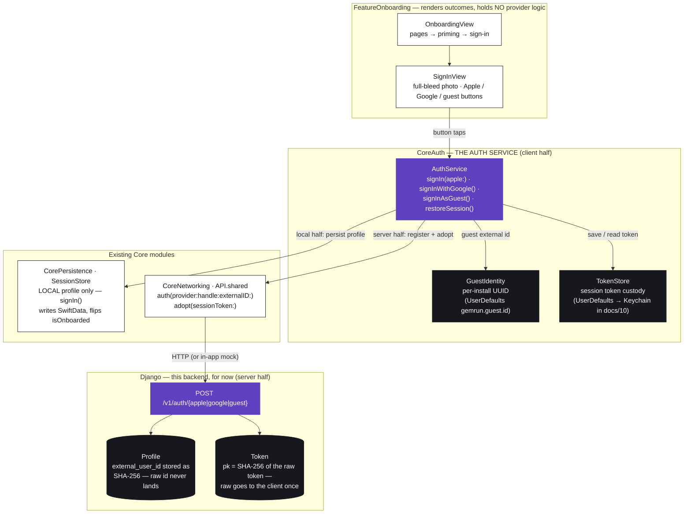
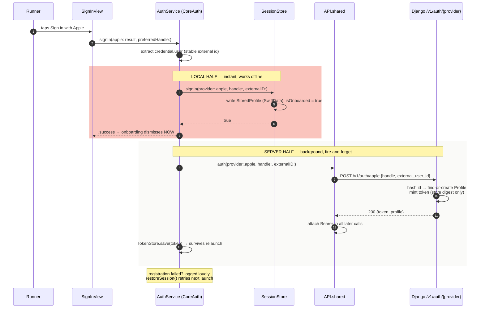
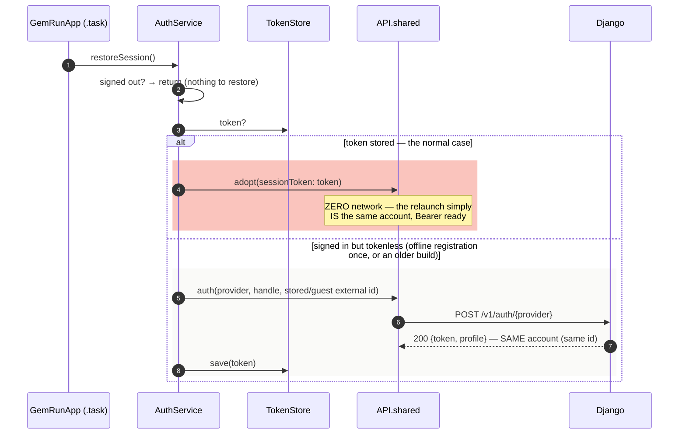
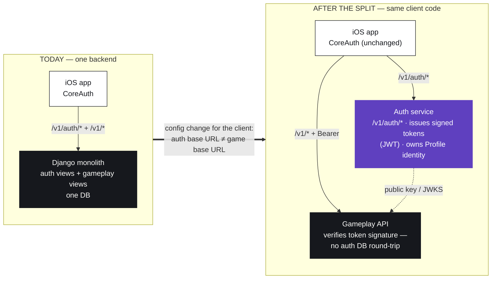

# 18 — The Auth Service (CoreAuth)

> Everything identity, behind one seam: provider sign-ins, stable unique
> accounts, the guest identity, session-token custody, and launch restore.
> The client half is the **CoreAuth** package; the server half is Django's
> **`/v1/auth/*`** — running inside this backend **for now**, with the
> extraction line for a dedicated auth service already drawn (§7).

Palette key, same as docs/16–17 — 🟪 pulse `#5F40BF` (actions &
identity flow) · ⬛ ink `#16181D` (data that must be protected) · ⬜ snow
`#FAFAF8` / white cards (client surfaces).

---

## 1. The architecture — one seam for identity

Before this module existed, identity was smeared across three places:
provider handling lived in an onboarding file, server registration was a
fire-and-forget task inside **SessionStore** (persistence doing network
identity work), and the session token lived in a variable that died with the
process. Now every identity concern has exactly one home:

The dependency direction is strict and cycle-free: `CoreAuth` sits **above**
`CorePersistence` and `CoreNetworking`; `FeatureOnboarding` and the App
target sit above `CoreAuth`. Nothing below CoreAuth knows identity exists —
SessionStore's old fire-and-forget auth task is gone.

| Piece | Owns | Deliberately does NOT own |
|---|---|---|
| `AuthService` | provider credential handling, registration, restore, outcomes | UI, persistence details |
| `GuestIdentity` | the per-install UUID that makes guests durable | anything network |
| `TokenStore` | raw-token custody across launches | minting or validating tokens |
| `SessionStore.signIn` | writing the local profile, opening the app | any network call |
| `API.shared` | the wire (`auth`, `adopt`) | deciding *when* to authenticate |
| Django `/v1/auth/*` | truth: profiles, hashing, token mint | trusting the client blindly after docs/10 |

---

## 2. Unique accounts — the mechanics

Every sign-in path now carries a **stable external id**, and the server keys
the account on it. Same id → the **same profile**, every time, on every
device and reinstall.

| Path | External id | Why it's stable |
|---|---|---|
| Sign in with Apple | `credential.user` — Apple's per-team user id | Apple guarantees it per Apple ID + team, across devices |
| Google (when the SDK lands, docs/10) | Google's subject (`sub`) id | Google guarantees it per account |
| Continue as guest | `GuestIdentity.id` — one UUID minted per install | minted once, kept in UserDefaults; every guest tap reuses it |

Server side (`auth_provider`, `backend/api/views.py`):

1. The raw external id is **hashed (SHA-256) before it touches the
   database** — lookups hash first, so the provider's real id never lands at
   rest (verified by test: the raw id appears nowhere in the DB).
2. Lookup `(provider, hashed id)` → found: same profile returned (handle
   refreshed). Not found: profile created **once**, welcome gift granted.
3. A fresh session token is minted per sign-in: the **raw token goes to the
   client exactly once**; the DB keeps only its SHA-256 digest as the key.

What this fixed — the two bugs that made accounts non-unique before:

- the HTTP client **dropped `externalID`** on the floor (sent only
  `handle`), so the server minted a brand-new profile on every sign-in;
- the token lived in a **memory-only variable**, so every relaunch ran
  unauthenticated and the dev server answered with fallback identity.

---

## 3. Sign-in, end to end

The split matters: the **local half** decides whether the user gets in
(instant, offline-safe — unchanged behavior), while the **server half**
makes the account real and durable. A dead network delays durability, never
entry.

---

## 4. Relaunch — the restore path

`GemRunApp` calls `AuthService.restoreSession()` once at launch, right after
`SessionStore.attach` (restore needs the stored profile):

The second branch is the **convergence** path: an install that never managed
to register still ends up on the same account — the external id, not the
token, is the identity; the token is just this session's proof.

---

## 5. Accurate buttons — the UI contract

Rule: **a button appears only if it works, and reports only what actually
happened.**

| Button | Now | Before (inaccurate) |
|---|---|---|
| Sign in with Apple | success → in; failure → the real error, visibly; **cancel → nothing** (backing out isn't an error) | any failure silently fell through to a guest-ish account — "Sign in with Apple" sometimes meant "become a guest" |
| Continue with Google | **hidden entirely** unless the GoogleSignIn SDK is compiled in (`AuthService.isGoogleSignInAvailable`) | always shown, never able to do Google — pretending |
| Continue as guest | exactly what it says — a real, durable account keyed to this install's `GuestIdentity` | a fresh throwaway server profile per session |

The dev flag (`AuthFlags.allowAllAccounts` / `ALLOW_ALL_ACCOUNTS`) still
keeps the *server* permissive while token verification is unbuilt — but
permissive ≠ anonymous: accounts are already unique via external ids, so
everything earned survives the docs/10 flag flip.

---

## 6. Token custody

| Stage | Where the token lives | Notes |
|---|---|---|
| In flight | `AuthResponse.token` | HTTPS in production |
| This process | `HTTPGemRunAPI.token` → `Authorization: Bearer` | unchanged |
| Across launches | **`TokenStore`** (UserDefaults `gemrun.session.token`) | **new** — the piece that was missing |
| At rest, server | SHA-256 digest only (`Token.key`) | raw token exists client-side only |
| docs/10 | Keychain | `TokenStore` is deliberately the ONE type that change touches |

Sign-out flips `isOnboarded` off; `restoreSession()` is gated on it, so a
signed-out relaunch adopts nothing, and the next sign-in overwrites the
stored token.

---

## 7. The future split — "use this backend for now"

Today `/v1/auth/*` runs inside the gameplay Django app — same process, same
SQLite. That's the right size for now. The seam is already service-shaped,
so the extraction is mechanical, not a rewrite:

What makes the split cheap later:

- **Client:** features never call auth — only CoreAuth does. Pointing
  `auth(...)`/`adopt(...)` at a different host is a CoreNetworking config
  concern; zero feature code moves.
- **Server:** auth touches only `Profile` + `Token`; gameplay reads identity
  through one helper (`profile_from`). Swap its digest lookup for JWT
  signature verification and the gameplay API no longer needs the auth DB.
- **Wire:** the contract (`POST /v1/auth/{provider}` → `{token, profile}`)
  is already the public boundary, documented in docs/17 Moment 1.

---

## 8. What docs/10 still owes (named, not hidden)

1. **Verify identity tokens server-side** — Apple `identityToken` / Google
   `idToken` signature checks in `auth_provider`; then flip
   `ALLOW_ALL_ACCOUNTS` and `AuthFlags.allowAllAccounts` to false (strict
   mode currently 501s with `auth_strict_mode`).
2. **GIDSignIn** in `signInWithGoogle` (GoogleSignIn SPM package + OAuth
   client ID) — the button un-hides itself the moment the SDK is compiled in.
3. **Keychain** for `TokenStore` (and Apple's paid-team `applesignin`
   entitlement, per project.yml's note).

---

## 9. File map

| File | Role |
|---|---|
| `Packages/GemRunCore/Sources/CoreAuth/AuthService.swift` | the service: providers, `GuestIdentity`, `TokenStore`, `restoreSession` |
| `Packages/GemRunCore/Sources/CoreNetworking/GemRunAPI.swift` | wire contract: `auth(provider:handle:externalID:)`, `adopt(sessionToken:)` |
| `Packages/GemRunCore/Sources/CoreNetworking/APIClient.swift` | sends `{handle, external_user_id}` to `POST /v1/auth/{provider}` |
| `Packages/GemRunCore/Sources/CorePersistence/SessionStore.swift` | the LOCAL half only — no network |
| `Packages/GemRunFeatures/Sources/FeatureOnboarding/SignInView.swift` | renders outcomes; hides what can't work |
| `App/Sources/GemRunApp.swift` | calls `restoreSession()` at launch |
| `backend/api/views.py` (`auth_provider`) | find-or-create by hashed external id; token mint |
| `backend/api/tests.py` | same-id→same-account, guest stability, raw-id-never-stored |

*Related: docs/17 Moments 0–1 (the exact payloads) · docs/10 (launch
checklist) · docs/16 §2 (where CoreAuth sits in the full stack).*
