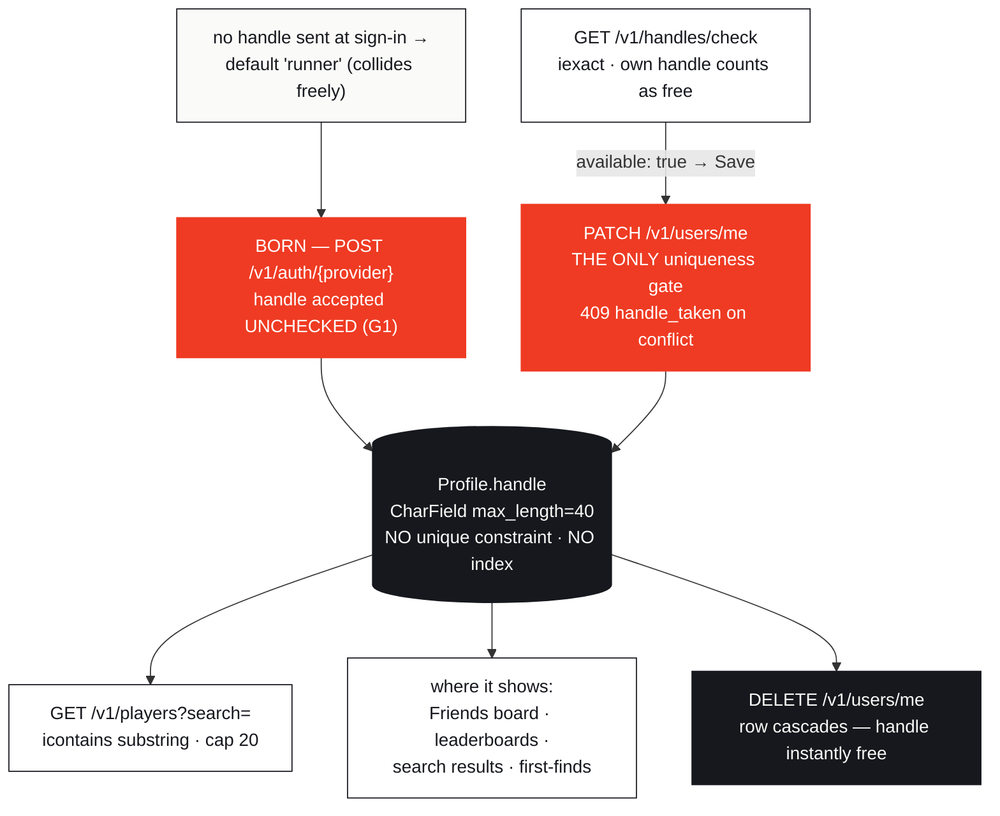
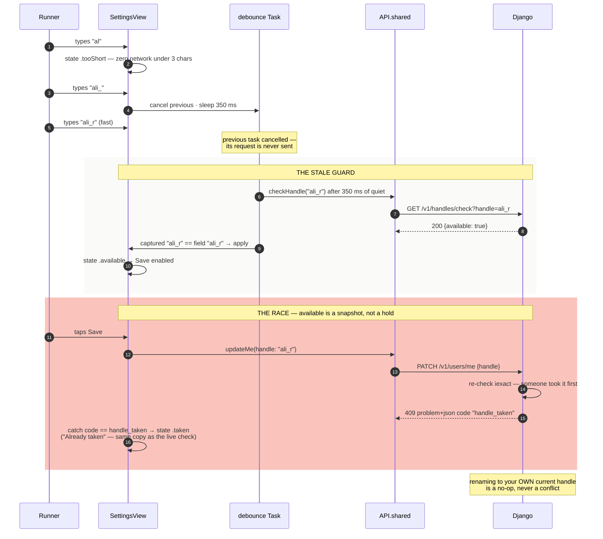
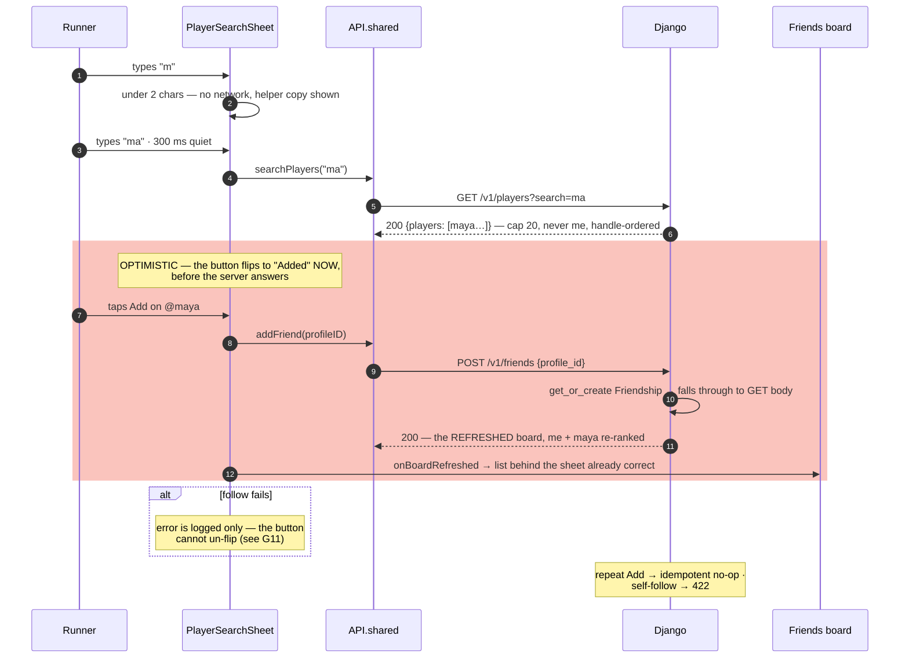
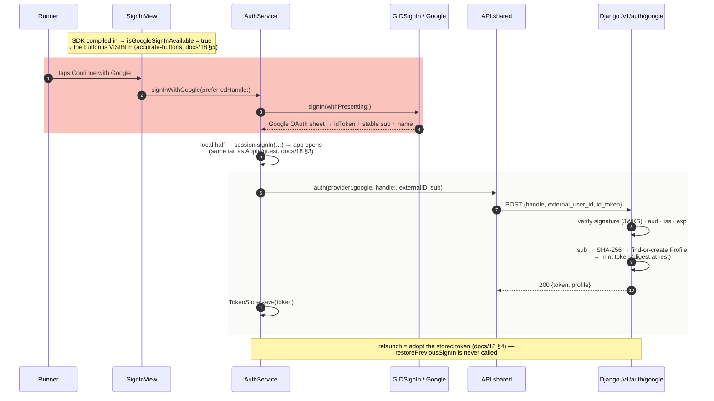

# 19 — The Auth & Accounts Handbook

> docs/18 is how identity is **built** — the CoreAuth module, unique
> accounts, tokens, the future service split. This doc is how accounts are
> **operated**: every account action end to end (username availability,
> renames, finding players, follows, sign-out, deletion), the complete
> **Google sign-in turn-on recipe**, and a tiered **enhancement roadmap**
> built from verified gaps. Sign-in and relaunch mechanics live in docs/18
> §3–4 and are not repeated here.

Palette key, same as docs/16–18 — 🟥 pulse `#EF3B23` (actions &
identity flow) · ⬛ ink `#16181D` (data at rest) · ⬜ snow `#FAFAF8` / white
cards (client surfaces).

---

## 1. The account surface at a glance

Everything an account can do today, in one table. `Auth?` is whether the
endpoint needs a Bearer token — a column worth reading twice, because
several account operations deliberately work anonymously.

| Endpoint | Auth? | Fires when | Response feeds |
|---|---|---|---|
| `POST /v1/auth/{apple\|google\|guest}` | none | sign-in · launch token-recovery (docs/18 §3–4) | `token` → every later call · `profile` → local store |
| `GET /v1/handles/check?handle=` | **optional** — authed callers get their own handle excluded | Settings editor, per keystroke (debounced) | `available` → enables Save (§3) |
| `GET /v1/users/me` | required | available (profile is cached locally) | profile refresh |
| `PATCH /v1/users/me` | required | Save in the username editor | new profile — or **409 `handle_taken`** (§3) |
| `DELETE /v1/users/me` | required | Settings danger zone | `{}` → local erase + sign-out (§5) |
| `GET /v1/players?search=` | **optional** — authed callers are excluded from their own results | Find-players sheet, per keystroke (debounced) | `id` → the follow POST (§4) |
| `GET /v1/friends` | required | Compete → Friends board | the weekly board |
| `POST /v1/friends` | required | Add tapped in search | **the response IS the refreshed board** (§4) |
| `DELETE /v1/friends/{id}` | required | swipe-to-remove | `{}` — idempotent, always 200 |
| `GET /v1/leaderboards/local` | required | weekly XP board | entries (handles surface here too) |

Where each lives server-side (all in `backend/api/`, routed by `urls.py`):

| Operation | View function (`views.py`) | Model rows touched (`models.py`) |
|---|---|---|
| sign-in / register | `auth_provider` | `Profile` (find-or-create), `Token` (mint) |
| availability check | `handle_check` | `Profile` (read) |
| profile read/rename/delete | `me` | `Profile` (+ cascade on DELETE) |
| player search | `players` | `Profile` (read) |
| friends board + follow | `friends` | `Friendship` (get_or_create), `Run` (weekly sums) |
| unfollow | `friend_detail` | `Friendship` (delete own row) |

Errors are always `application/problem+json` (`{"title", "detail",
"code"}`) — the client branches on `code`, never on prose.

> **Dev-posture callout:** none of these endpoints are rate limited — the
> availability check and player search fire on every (debounced) keystroke
> by design. Fine for now, a real gap before launch — see **G3** in §7.

---

## 2. The life of a handle

The handle is the app's public identity — it's what boards, search results,
and first-finds show. Here is its whole life, and the honest part: the
rules that govern it are enforced **unevenly** across its three write
paths.

Who enforces what, where — the uneven part, laid flat:

| Rule | At sign-in (`auth_provider`) | At rename (`handle_check` + PATCH) | At search (`players`) |
|---|---|---|---|
| Minimum length | none (empty → `"runner"`) | **3 chars** (check refuses below) | 2 chars to search |
| Uniqueness | **not checked** — duplicates possible | **enforced**, case-insensitive (`iexact`), 409 on race | n/a |
| Case handling | stored as typed | `iexact` compare | `icontains` compare |
| Charset / format | none — spaces, emoji, `@` all accepted | none | n/a |
| Max length | 40 (database column only) | 40 (column only) | n/a |

Plainly stated, because a handbook should say it: **uniqueness is
application-level and enforced at exactly one of the three write paths.**
Sign-in (create *and* re-sign-in) sets the handle unchecked; every
handle-less sign-in defaults to `runner`; a rename to an empty string is
silently ignored rather than rejected (the PATCH guard skips it). None of
this corrupts anything today — the dev flag era mints test accounts by the
dozen — but it's the first thing to tighten before real users (**G1, G2,
G5** in §7).

---

## 3. "Is this username taken?" — availability, end to end

The question the Settings editor answers live, on every keystroke. Full
path: server rules → client seam → the six UI states → the race.

**Server rules** (`handle_check` in `views.py` — the docstring is the
contract: *"is this handle free for the CALLER to take? Your own current
handle counts as free"*):

| Rule | Behavior |
|---|---|
| Param | `handle`, whitespace-stripped; missing → empty |
| Too short | `len < 3` → `{"available": false}` — no DB query |
| Match | `Profile.objects.filter(handle__iexact=…)` — case-insensitive |
| Self-exclusion | authed caller's own row excluded → renaming to yourself reads as free |
| Auth | optional — anonymous callers simply skip self-exclusion |
| Response | always 200, `{"available": <bool>}` — nothing else |

**Client seam:** `GemRunAPI.checkHandle(_:)` → `APIClient` sends
`GET /v1/handles/check?handle=…`. The **mock keeps parity** so the taken
state is exercisable offline: same 3-char floor, five squatted competitor
names (`maya.runs`, `dev_collects`, `sam_routes`, `pace.ghost`,
`gemhound`), own handle always free.

**The six UI states** (`SettingsView` username editor):

| State | Shown as | Save enabled? |
|---|---|---|
| `idle` | nothing (field empty) | no |
| `tooShort` | "At least 3 characters" | no |
| `checking` | "Checking availability…" + spinner | no |
| `available` | ✓ "Available" (pulse tint) | **yes** |
| `taken` | ✕ "Already taken" | no |
| `failed` | "Couldn't check right now. Try again in a moment." | no |

**Debounce mechanics:** every keystroke cancels the previous check task and
starts a fresh one that sleeps **350 ms** before calling the API — so a
fast typist sends one request, not nine. A **stale-response guard** then
compares the handle the task captured against the field's *current* text
before applying the answer, so a slow response for old text can never
overwrite the verdict for what's on screen now.

**The race — and why 409 exists:** "available" is a snapshot, not a
reservation. Someone can take the name between your live check and your
Save. The server re-checks inside PATCH and answers **409
`handle_taken`**; the client catches exactly that code and flips the state
to `.taken` — same UI as the live check, no crash, no silent failure.

*Exact wire payloads for this pair: docs/17 Moment 9.*

---

## 4. Finding players — search by handle, and the follow chain

Search exists to feed the **Friends board** (Compete). The chain is:
type a handle fragment → pick a player → follow → the board refreshes
itself in the same response.

**Server rules** (`players` in `views.py`):

| Rule | Behavior |
|---|---|
| Param | `search`, stripped; `len < 2` → `{"players": []}` |
| Match | `handle__icontains` — case-insensitive **substring** ("EMH" finds "gemhunter") |
| Self-exclusion | authed caller never appears in their own results |
| Order & cap | alphabetical by handle, **first 20** — no pagination |
| Response | `{"players": [{"id", "handle", "level"}]}` |

> Honest scale note: `icontains` on an **unindexed** column is a table scan,
> and the hard cap has no "next page." Fine at hundreds of players; **G4**
> at thousands.

**The sheet** (`PlayerSearchSheet` in `CompeteRootView.swift`): opened from
the magnifier on the Friends board, titled **"Find players"**. Field
placeholder "Search by username"; below two characters it shows *"Type at
least two letters of a username."*; no matches shows *"No players match
"query"."* Debounce is **300 ms** with the same task-cancellation pattern
as §3. The client repeats the 2-char gate so the server minimum is never
even tested.

**Follow semantics** (`friends` + the `Friendship` model): the model
docstring is the philosophy — *"YOUR friends list is yours — adding
someone puts them on your weekly board, removing them only edits your
list. Mutual consent can layer on later without a schema change."*

| Property | Behavior |
|---|---|
| Direction | **one-directional follow** — no request/accept |
| Duplicates | `UniqueConstraint(profile, friend)` + `get_or_create` → repeat adds are no-ops |
| Self-follow | 422 "You're already on your own board" |
| Unknown player | 404 "No such player" |
| Unfollow | `DELETE /v1/friends/{id}` deletes **only your follow row**; always 200, idempotent |
| The board | you + everyone you follow, weekly window (Monday 00:00 UTC), ranked by weekly XP |

**The wire trick, stated as a design decision:** `POST /v1/friends` falls
through to the GET body — the add response **is** the refreshed board.
One round-trip: follow lands and the re-ranked list arrives together.

*Exact wire payloads: docs/17 Moment 8.*

---

## 5. Leaving — sign-out and account deletion

Two exits with deliberately different weights, and one honest asymmetry.

**Sign-out is client-side only.** It flips `isOnboarded` off; the next
launch shows onboarding, and `restoreSession()` is gated on the flag so the
stored token is never adopted while signed out (docs/18 §6).

| On sign-out | Cleared? |
|---|---|
| `isOnboarded` flag | ✅ flipped off |
| Local profile / stash / runs (SwiftData) | ❌ kept (a sign-back-in resumes) |
| Stored session token (`TokenStore`) | ❌ kept — inert while signed out; overwritten on next sign-in |
| **Server token row** | ❌ **lives forever — there is no revocation endpoint** (G6) |

**Deletion is the real exit.** `DELETE /v1/users/me` hard-deletes the
profile server-side and **cascades**: tokens, runs, stash rows,
friendships. The client then erases local data and signs out. This is the
App Store 5.1.1(v) requirement (in-app account deletion), already
implemented in Settings' danger zone. Two consequences worth knowing:

- the handle becomes **instantly re-registrable** (nothing reserves it);
- gems you placed persist unlinked (the map keeps its history, docs' legal
  section covers this).

---

## 6. Google sign-in — the turn-on recipe

Today the Google button **hides itself**: `AuthService.signInWithGoogle`
sits behind `#if canImport(GoogleSignIn)`, and SignInView only shows the
button when `AuthService.isGoogleSignInAvailable` is true (the
accurate-buttons contract, docs/18 §5). The backend **already accepts**
`provider = "google"`. So the recipe below is genuinely a turn-on: complete
it and the button appears with **zero UI work**.

**The recipe, in order:**

1. **SPM package** — add `GoogleSignIn-iOS` to
   `Packages/GemRunCore/Package.swift` as a package dependency and to the
   **CoreAuth target's** dependencies (that's where the `canImport` gate
   lives). Run `xcodegen` (via `./run.sh app`) so the project picks it up.
2. **GCP Console** — create an OAuth client ID, type **iOS**, bundle id
   `com.gemrun.GemRun` (XcodeGen: `bundleIdPrefix com.gemrun` + target
   `GemRun`). This yields the **client ID** and its **reversed client ID**.
3. **`project.yml` info properties** — there is **no committed
   Info.plist**; XcodeGen generates it, so both keys go here: add
   `GIDClientID: <client id>` and a second `CFBundleURLTypes` entry whose
   scheme is the reversed client ID (today the only scheme is `gemrun`).
4. **Client code slot** — inside the existing `#if canImport(GoogleSignIn)`
   branch of `AuthService.signInWithGoogle`:
   `GIDSignIn.sharedInstance.signIn(withPresenting:)` → on success take the
   user's `idToken` + profile, and call the same `complete(provider:.google,
   handle:, externalID:)` tail every provider uses — Google's **`sub`**
   claim is the stable external id.
5. **Server verification** (`auth_provider`, the docs/10 half) — verify the
   forwarded `id_token` before trusting the identity:

   | Check | Against |
   |---|---|
   | Signature | Google's public JWKS (`https://www.googleapis.com/oauth2/v3/certs`) |
   | `aud` | equals **your** OAuth client ID |
   | `iss` | `accounts.google.com` (or `https://accounts.google.com`) |
   | `exp` | still in the future |

   Then `sub` → `external_user_id`, hashed like every provider (docs/18
   §2). The `google-auth` Python package does all four in one call.
6. **Restore: nothing to do.** `GIDSignIn.restorePreviousSignIn` is **not
   needed** — GemRun keeps its own session token, and relaunch is the
   docs/18 §4 adopt path. Google is consulted only at sign-in time.

Config artifacts at a glance:

| Artifact | Lives in | Shape |
|---|---|---|
| SPM dependency | `GemRunCore/Package.swift` (CoreAuth target) | `GoogleSignIn` product |
| Client ID | `project.yml` → generated Info.plist | `GIDClientID: 1234…apps.googleusercontent.com` |
| URL scheme | `project.yml` `CFBundleURLTypes` | `com.googleusercontent.apps.1234…` (reversed) |
| Server check | `backend/api/views.py` `auth_provider` | JWKS + aud/iss/exp → `sub` |

> **Honesty note:** until step 5 ships (G8), the server accepts the
> external id **unverified** under `ALLOW_ALL_ACCOUNTS` — accounts are
> unique, but the id isn't yet *proven*. Same posture as Apple today.

---

## 7. The enhancement roadmap — everything we can handle and enhance

First the **gap register**: every gap below was verified against the code
this doc describes (earlier sections reference these by number).

| # | Gap | Where | Consequence |
|---|---|---|---|
| G1 | Handle uniqueness enforced **only on rename** — sign-in sets it unchecked; no DB unique constraint or index | `auth_provider` · `Profile.handle` | duplicate handles at sign-up; `runner` collides freely |
| G2 | No handle format rules — charset/emoji/spaces all accepted; empty rename silently ignored | `handle_check` · `me` PATCH | unsearchable or impersonation-prone names |
| G3 | No rate limiting anywhere — auth, per-keystroke check, search | all views | trivially scriptable enumeration & spam |
| G4 | Search is unindexed `icontains`, hard cap 20, no pagination | `players` · `Profile.handle` | table scans + invisible results at scale |
| G5 | No reserved/blocked handle list, no profanity moderation | nowhere | `admin`, `gemrun`, slurs are all claimable |
| G6 | Tokens never expire; no server-side sign-out or revocation; every sign-in adds an eternal `Token` row | `Token` model | a leaked token works forever |
| G7 | No account linking — a guest can't upgrade to Apple/Google keeping stash/XP | `auth_provider` | progress loss on the natural upgrade path |
| G8 | Identity-token verification unbuilt; `ALLOW_ALL_ACCOUNTS` on | `auth_provider` · `AuthFlags` | external ids are claims, not proofs (docs/10) |
| G9 | Session token in UserDefaults, not Keychain | `TokenStore` (CoreAuth) | weaker at-rest protection (docs/10) |
| G10 | `avatar_url` always null — no avatars | `profile_json` | text-only identity |
| G11 | Follow failures logged-only (button can't un-flip); no blocked-users or discoverability controls | `PlayerSearchSheet` · `players` | anyone can find & follow anyone, silently |

Now the plan — four tiers, in the order they should land.

### Tier 1 — before real users: make what exists true

Everything here turns a promise this doc currently footnotes into an
enforced fact.

| Enhancement | Closes | Effort | Lands in |
|---|---|---|---|
| Verify Apple `identityToken` / Google `idToken`; flip `ALLOW_ALL_ACCOUNTS` + `AuthFlags.allowAllAccounts` | G8 | M | `auth_provider` · CoreAuth `register` |
| Keychain for the session token | G9 | S | `TokenStore` — deliberately the one type that changes |
| **Handle integrity package**: charset regex (e.g. `[a-z0-9._]{3,20}`), reserved-name list, uniqueness check at sign-in, then a DB **unique index** | G1 G2 G5 | M | `models.py` + migration · `auth_provider` · `handle_check` |
| Rate limiting (auth, check, search first) | G3 | S–M | new middleware beside `RequestLogMiddleware` |

*The one sequencing rule:* the unique index **must be preceded by a
collision migration** — existing duplicate handles (every `runner`) get
suffixed first, or the migration fails on real data.

### Tier 2 — session hygiene: make sessions endable

| Enhancement | Closes | Effort | Lands in |
|---|---|---|---|
| Token expiry + refresh-on-use (or short-lived JWT, aligning with docs/18 §7's split) | G6 | M | `Token` model · `profile_from` · CoreAuth adopt path |
| `POST /v1/auth/signout` (revoke this token) + revoke-all-sessions | G6 | S | new views; delete digest rows; call from `signOut` |
| Auth event audit log (sign-ins, renames, deletions — provider + hashed id, never raw) | — | S | new model, written from `auth_provider`/`me` |

### Tier 3 — when social grows: make social safe

| Enhancement | Closes | Effort | Lands in |
|---|---|---|---|
| **Account linking** — guest → Apple/Google upgrade that keeps stash/XP (natural now: guest ids are stable, so `POST /v1/auth/link` just re-keys the same profile to the new provider id) | G7 | M | `auth_provider` sibling view · CoreAuth |
| Blocked users + a discoverability toggle (opt out of search) | G11 | M | new model · filters in `players`/`friends` |
| Surface follow failures (un-flip the Add button on error) | G11 | S | `PlayerSearchSheet` |
| Avatars (finally non-null `avatar_url`) | G10 | M | `Profile` · upload or preset picker |
| Email magic-link provider | — | M | new provider branch, same external-id mechanics |
| Passkeys (`ASAuthorizationPlatformPublicKeyCredential`) | — | L | CoreAuth + server challenge endpoints |

### Tier 4 — at scale: make it big

| Enhancement | Closes | Effort | Lands in |
|---|---|---|---|
| `db_index` on handle + search pagination (cursor by handle) | G4 | S | `models.py` · `players` |
| App Attest (the docs/06 payload field exists; nothing consumes it yet) | — | L | client attest + server verify |
| Extract the auth service from the monolith | — | L | the docs/18 §7 boundary — already drawn |

Reading the whole table at once: **Tier 1 makes what exists true, Tier 2
makes sessions endable, Tier 3 makes social safe, Tier 4 makes it big.**

---

## 8. File map

| File | Role in this doc |
|---|---|
| `Packages/GemRunFeatures/Sources/FeatureProfile/SettingsView.swift` | the six-state availability machine, 350 ms debounce, 409 handling (§3) |
| `Packages/GemRunFeatures/Sources/FeatureCompete/CompeteRootView.swift` | `PlayerSearchSheet` — search, optimistic follow (§4) |
| `Packages/GemRunCore/Sources/CoreNetworking/{GemRunAPI,APIClient,MockGemRunAPI}.swift` | `checkHandle` / `searchPlayers` / friends calls + mock parity |
| `Packages/GemRunCore/Sources/CoreAuth/AuthService.swift` | the `#if canImport(GoogleSignIn)` slot the recipe fills (§6) |
| `backend/api/views.py` | `auth_provider` · `handle_check` · `me` · `players` · `friends` · `friend_detail` |
| `backend/api/models.py` | `Profile` (the unconstrained handle) · `Token` · `Friendship` |
| `backend/api/urls.py` | the `/v1/` routes for all of the above |
| `project.yml` + `Packages/GemRunCore/Package.swift` | the two config files the Google recipe edits (§6) |

*Related: docs/18 (the auth architecture) · docs/17 Moments 8–9 (exact
payloads) · docs/16 §5 (backend design) · docs/10 (launch checklist) ·
docs/06 (the wire contract).*
